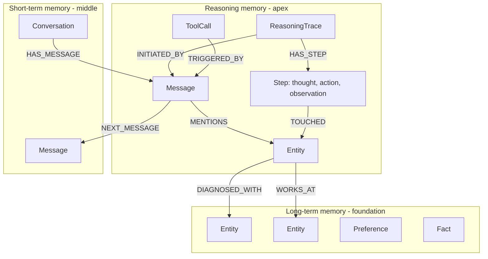
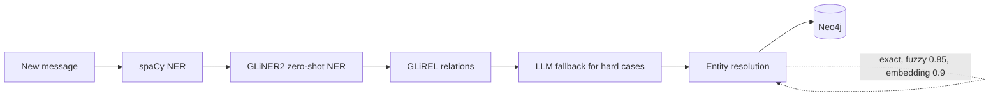
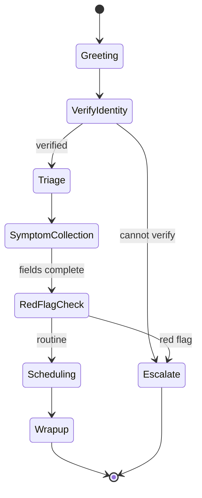
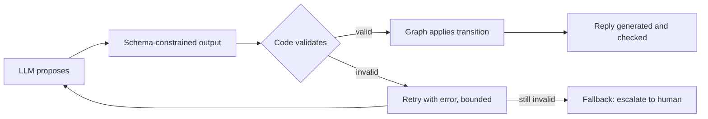

"Context graph" is used for at least three different things in 2025-2026 agent writing. Keep them apart, because a project proposal that blurs them is hard to evaluate.

## 1. The core idea

An LLM agent has no state of its own between tokens, turns or sessions. Everything it "knows" must be put into the prompt. A context graph is an external, structured store that decides what goes into that prompt, and records what the agent did afterward. The graph is the agent's scaffolding, not its brain.

| Concept | What it adds | Question it answers |
| :-- | :-- | :-- |
| Graph | Nodes and relationships | What is connected? |
| Knowledge graph | Semantics: types, taxonomy, rules | What do the connections mean? |
| Context graph (memory flavor) | Conversation state and decision traces on top of a knowledge graph | What matters right now, and why did we act before? |
| Context graph (workflow flavor) | Procedure: states, transitions, constraints | What should the agent be doing next? |

## 2. Three meanings

| Meaning | Graph models | Nodes and edges | Source |
| :-- | :-- | :-- | :-- |
| Memory graph | What the agent knows and did | Entities, messages, reasoning traces, tool calls | [Neo4j](https://neo4j.com/blog/agentic-ai/what-is-context-graph/) |
| Workflow graph | The work to be done | States with objectives, guidance, boundaries, tools; transitions with exit criteria | [Concurrence docs](https://docs.concurrence.com/agent/context-graphs) |
| Change graph | What is changing in the enterprise | Entities and state-change events, scored for proactive alerts | [arXiv 2607.07721](https://arxiv.org/abs/2607.07721) |

The first two are complementary: the workflow graph says what to do, the memory graph says what is known and what happened before.

## 3. The memory graph (Neo4j style)

### Three memory layers in one graph



- **Long-term:** slow-changing curated facts. Entities are multi-labelled, for example `:Entity:Person:Individual`, with `name`, `canonical_name`, `confidence` and an embedding. `Preference` and `Fact` nodes sit alongside.
- **Short-term:** `Conversation`, `Message` with `NEXT_MESSAGE` ordering, and `MENTIONS` edges to entities that carry a confidence and text span.
- **Reasoning:** a trace is a tree of trace, steps, tool calls. A step records thought, action and observation. A tool call records tool name, arguments, result, status and duration. Traces also store an outcome and a success flag.

Label names vary by source: the neo4j-agent-memory docs use `ReasoningTrace`, while the create-context-graph docs describe `DecisionTrace` and `TraceStep`. Pick one and stay consistent in your own schema.

### Write path



- Extraction is a staged pipeline that escalates from cheap statistical NER to an LLM only when needed.
- Entity types follow POLE+O: Person, Object, Location, Event, Organization, a model borrowed from intelligence analysis. Custom types are allowed, and the healthcare template adds Patient, Provider, Diagnosis, Treatment, Encounter, Facility and Medication.
- Resolution is composite: exact match, then fuzzy string match, then embedding similarity, so "John Smith" and "Johnny Smith" can merge.
- Reasoning traces are not derived automatically. Your agent code explicitly starts a trace, adds steps, records tool calls and completes the trace with an outcome.

### Read path

At query time one `get_context` call combines three lookups: recent and semantically similar messages, related entities and preferences, and similar past traces. Underneath it mixes vector search with graph traversal and property filters. The docs show Cypher like this:

```cypher
CALL db.index.vector.queryNodes('message_embedding', 10, $embedding)
YIELD node AS m, score
MATCH (m)-[:MENTIONS]->(e:Entity {type: "PERSON"})
WHERE m.created_at > datetime() - duration('P7D')
RETURN m.content, e.name, score
```

The audit query is the distinctive one: find every entity touched by a reasoning step, then walk back to the trace and its outcome, which answers "why did the agent say that?" from data instead of logs.

### Tooling

[create-context-graph](https://github.com/neo4j-labs/create-context-graph) scaffolds a FastAPI backend and Next.js frontend with a graph viewer and a decision-trace panel, driven by one ontology YAML. It supports several agent frameworks including LangGraph, PydanticAI and Claude Agent SDK. A `healthcare` domain exists. Memory comes from [neo4j-agent-memory](https://github.com/neo4j-labs/agent-memory). Both are Neo4j Labs projects: beta, community supported.

## 4. The workflow graph (Concurrence style)

Concurrence (formerly Amigo) builds clinical voice, SMS and chat agents. Its context graph is an authored hierarchical state machine.



- **State types in the current docs:** action (talk to the user), decision (choose an exit), annotation (inject guidance, no extra model turn), data collection (gather structured fields, with turn limits and a form fallback).
- **Each state carries:** objective, ordered guidance, boundaries, exit criteria, which tools are exposed, typed guardrails and a turn policy. Safety rules therefore sit next to the step they govern.
- **Navigation:** every turn the LLM chooses the next state from the conversation, patient data and the constraints on each transition. It can pass through several states in one turn, with loop detection and an iteration cap. Navigation is probabilistic, so the graph is not a formal guarantee.
- **Versus a decision tree:** lateral and backward moves are allowed, and strictness varies by region of the graph.
- **Dynamic behaviors:** semantic triggers ("caller mentions chest pain") that inject instructions or swap tools for one turn without changing topology. In the current docs this is a Classic API feature. The newer platform expresses the same logic directly in graph states and transitions.

### Memory beside the graph

The graph describes the work. A separate memory system describes the person. The current docs describe three operations:
1. **Observe:** after a call, extract net-new observations by comparing the transcript to the current user model.
2. **Consolidate:** merge recent observations into a bounded narrative user model.
3. **Recall:** a read-only keyword search over history, newest first, capped and explicitly not exhaustive.

Structured clinical state (conditions, medications, allergies) is a deterministic projection from EHR events, not model-generated, and outranks generated memory on conflict. Memory processing is asynchronous, so something said in this call is not cross-session memory until post-call processing finishes.

### World model (data layer)

Concurrence's "Health World Model" is an event-sourced store: new facts are immutable events with provenance and a source-confidence rank (authoritative 1.0, EHR-trusted 0.8, patient self-report 0.5, raw agent inference 0.3). Current state is a computed projection, with source rank then recency deciding conflicts. In their usage this is a governed knowledge base, not a learned dynamics model in the RL sense (compare [[World Models]]).

### Simulation and evaluation

The docs describe personas, scenarios, cases, suites and runs. A model plays the patient, the real production pipeline answers, and judges score the conversation. A simulation bridge can steer simulated users toward untested graph states, fork sessions at decision points and report coverage including never-reached states. Teams split metrics into required checks and improvement targets. The platform records evidence but does not block a release by itself.

## 5. The change graph (proactive enterprise agents)

[Kumar, arXiv 2607.07721](https://arxiv.org/abs/2607.07721) models enterprise entities as a time-stamped directed graph. Every mutation emits a delta event. Threshold rules turn deltas into candidate insights, each with a two-hop neighborhood snapshot. A score ranks them per user:

$$P(c,u) = w_1 U(c) + w_2 R(c,u) + w_3 F(c,u) + w_4 K(c)$$

with urgency, relevance (graph distance to the user), persona fit and confidence, and weights 0.35, 0.30, 0.20, 0.15. An LLM only writes the notification text from the snapshot. Treat it as a design pattern, not evidence: the evaluation is on synthetic scenarios built by the author, the baseline is a reactive RAG agent so the time-to-surface win is by construction, and there are no ablations.

## 6. Standardizing agent outputs

Two kinds of output need different treatment. Control outputs (next state, extracted fields, tool arguments) must be machine-checkable. User-facing text cannot be made identical, only constrained by properties.



1. **Constrain the format.** Use the provider's structured output or strict tool calling so the reply is a typed object. Syntax is then guaranteed, meaning is not.
2. **Offer only legal choices.** For navigation, make the output an enum of the authored exits from the current state, so an illegal state cannot be named.
3. **Validate in code.** Schema types, ranges, allowed values and cross-field rules. A failure triggers a bounded retry with the error fed back, then a safe fallback such as escalation.
4. **Let the graph, not the model, apply transitions.** The LLM proposes, deterministic code checks guards (required fields collected, tool succeeded) and moves the state.
5. **Separate decision from utterance.** One structured call decides, a second writes the reply. Safety-critical triggers such as red-flag detection can also have a deterministic backstop.
6. **Check free text by properties.** Rule checks (must offer escalation) and a judge model at temperature 0.
7. **Measure it.** Schema-violation rate, illegal-transition proposals, retry rate and run-to-run agreement on the same input.

## 7. How good is the evidence

| Claim | Status |
| :-- | :-- |
| Graphs give better multi-hop and explainable retrieval than flat logs | Plausible, asserted by Neo4j, no benchmark found in the pages read |
| Decision traces improve auditability | Mechanistically true (the data is queryable), not measured against alternatives |
| State-machine scaffolding improves clinical safety | Vendor claim; the docs themselves warn it is probabilistic |
| Concurrence figures (millions of simulations, 99.9% safety, efficiency gains) | Marketing, no methodology published |
| Proactive agent precision | Synthetic, circular rules and labels |

That lack of independent evaluation is the opening for a student project: a small, honest, reproducible comparison.

## 8. Related work and connections

- [Graph-Based Agentic AI with LangGraph (arXiv 2607.19297)](https://arxiv.org/abs/2607.19297): typed state, conditional routing, interrupts and checkpoints for long-running workflows.
- Microsoft [GraphRAG](https://www.microsoft.com/en-us/research/project/graphrag/): graph-structured retrieval over text.
- [[Agentic Information Traversal]] - How agents are benchmarked when walking graphs.
- [[World Models]] - State, transition and environment modeling.
- [[Markov Decision Processes]] - The formal view of states, actions and transitions behind workflow graphs.
- [[Database Types]] - Where graph databases like Neo4j fit.
- [[Bayesian Networks]] - Another graph-structured way to reason under uncertainty.
