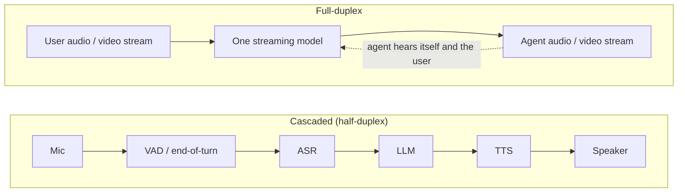

A full-duplex agent listens and speaks at the same time, so interruptions, backchannels ("mm-hm") and silences are handled inside the model instead of by a turn-detection rule. This note covers the voice and video systems that do this, how they are evaluated, and the open problems. Details come from vendor posts, papers and press coverage as of October 2026; vendor claims are marked as self-reported.

## Cascaded vs. full-duplex

In a cascaded stack the system waits for the user to finish before it starts. A full-duplex model treats the user's stream and its own as parallel streams generated together, so it can nod or say "mm-hm" mid-sentence, stop when interrupted, or hold a silence without treating it as a turn end.

## Voice systems

| Who | System | Notes |
|---|---|---|
| Kyutai | [Moshi](https://arxiv.org/abs/2410.00037) | Open-source original. Two parallel audio streams plus an "inner monologue" of text tokens; about 200 ms latency in practice. |
| NVIDIA | PersonaPlex (7B) | Built on Moshi's architecture, adds voice cloning and role control via hybrid prompts. *Source: [MarkTechPost](https://www.marktechpost.com/2026/01/17/nvidia-releases-personaplex-7b-v1-a-real-time-speech-to-speech-model-designed-for-natural-and-full-duplex-conversations/)* |
| OpenAI | [GPT-Live](https://openai.com/index/introducing-gpt-live/) | Full-duplex voice with backchannels; hands hard reasoning to a larger backend model while the conversation continues. *Source: [TechCrunch](https://techcrunch.com/2026/07/08/openai-releases-new-voice-models-for-more-natural-live-conversations/)* |
| Google | Gemini Live | Native speech-to-speech with visual grounding. *Source: [GPT-Live vs Gemini Live](https://apidog.com/blog/gpt-live-vs-gemini-live/)* |
| Sesame | [CSM](https://www.sesame.com/blog/crossing-the-uncanny-valley-of-voice) | Very natural voice, but still needs an LLM for text, so not strictly full-duplex. |
| ByteDance | Doubao | Reportedly fewer false responses and talk-overs than its half-duplex predecessor in production. |

## Video systems

### Tavus Griffin
Announced October 1, 2026 as the first "Human Interaction Model": full-duplex video-to-video. *Source: [Tavus, Griffin](https://www.tavus.io/griffin)*

- **Conversational engine:** perceives audio and video together, makes turn-taking decisions at sub-second intervals, and emits control signals for tone, expression and gesture.
- **Generation engine:** streaming speech with a diffusion transformer, plus a few-step autoregressive video diffusion model producing 720p in 320 ms chunks.
- **Speech codec:** a custom 48 kHz codec with continuous latents at 100 fps and a fully causal decoder (10 ms packets); voice cloning from about 10 s of audio.
- **Video distillation:** bidirectional teacher, then few-step student, then autoregressive model, then self-forcing for long-context stability. This follows [Self Forcing](https://arxiv.org/abs/2506.08009), which trains on the model's own rollouts to fix the train/test mismatch.
- **Self-reported numbers:** 0.43 s audio-to-video latency on H100s; 48% (26/54) of participants believed a one-minute call with Griffin-Lite was a real person, against 2.4% (1/41) for the previous Tavus stack.
- **Status:** restricted research preview. Tavus says further alignment and safety work is needed before release.

> [!warning] Read the headline claims carefully
> The Turing-test result is a small study (54 people, one minute each) run by the vendor, with no independent replication. [The Decoder](https://the-decoder.com/nearly-half-of-test-subjects-mistook-tavus-ai-video-avatar-for-a-real-person-on-a-one-minute-call/) reported it with little scrutiny.

### Other real-time avatar providers
- **Anam:** real-time avatar API, about 180 ms latency. *Source: [Anam](https://anam.ai/)*
- **Simli:** speech-to-video with 3D Gaussian splatting, under 200 ms.
- **Hedra:** Character-3 talking-avatar API.
- **Decart:** real-time video transformation (Lucy 2).
- **Surveys:** [live avatar landscape, 10 providers](https://medium.com/@ggarciabernardo/the-live-avatar-landscape-apis-transport-and-subjective-evaluation-of-10-leading-providers-5b5b6e8a54dc).
- **Research:** [DyaPlex](https://arxiv.org/pdf/2606.03874) (speech and motion for dyadic interaction), [Wan-Streamer](https://arxiv.org/pdf/2606.25041).

## Evaluation

| Benchmark | Measures |
|---|---|
| [Full-Duplex-Bench](https://arxiv.org/abs/2503.04721) (v1 to v3) | Pause handling, backchanneling, turn-taking, interruption management. [v3](https://arxiv.org/html/2604.04847v1) adds tool use under real-world disfluency. |
| [VideoFDB](https://arxiv.org/abs/2605.30256) (NVIDIA) | Audio-visual dyadic conversation: 237 real video-call clips, 11 nonverbal dynamics, perception vs. generation tracks, LLM-as-judge rubric. |
| [EchoChain](https://arxiv.org/pdf/2604.16456) | Reasoning when an interruption changes the state of the task. |
| TurnBench (Sesame) | Turn-taking in spoken dialogue. |

VideoFDB found two failure modes in existing agents: captioning collapse (describing the user's appearance instead of talking to them) and visual-stream ignorance (audio-only and audio-visual outputs are paraphrases of each other). On its generation track Griffin-Lite scored 3.83 of 5, against a 3.92 human reference and 2.80 for the next best system.

## Open problems
- **Fast front model, slow backend agent.** Duplex models are small and quick; reasoning and tools live in a larger model behind them. Calling tools mid-conversation is still an open design question ([architecture paper](https://arxiv.org/pdf/2609.19334)).
- **Knowing when to speak.** [One paper](https://arxiv.org/pdf/2609.19596) argues these models take the floor when asked, not when needed.
- **Safety under interruption**, e.g. in clinical settings ([paper](https://arxiv.org/pdf/2608.29241)).
- **Deception.** Photoreal, real-time video makes impersonation easy; Tavus itself holds Griffin back for this reason.
