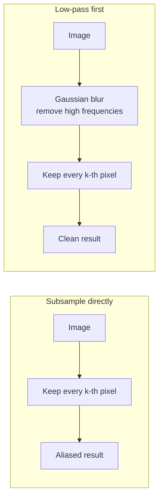

Shrinking an image looks trivial: keep every k-th pixel, as in `image[::k, ::k]`. Doing only that **throws pixels away** and, unless the image is smoothed first, corrupts what remains.

## Background: Spatial Frequency

An image can be described by how quickly its intensity changes across space. **Spatial frequency** counts those changes: a smooth gradient is low frequency, fine texture, thin lines and sharp edges are high frequency. A **low-pass filter** keeps the low frequencies and attenuates the high ones. A Gaussian is a natural low-pass filter because its frequency response is itself a Gaussian, with width inversely proportional to its spatial $\sigma$: a wider kernel in the image means a narrower pass-band.

## What Aliasing Is

By the **sampling theorem (Nyquist-Shannon)**, a signal can be reconstructed from its samples only if it is sampled at more than twice its highest frequency; equivalently, a sampling rate can only represent frequencies up to half that rate (the **Nyquist frequency**). For an image sampled once per pixel the limit is 0.5 cycles per pixel. Downsampling by 2 halves the sampling rate, so the new image can represent frequencies only up to **half of the original limit**.

If detail finer than that is not removed first, it does not simply disappear. It **folds into lower frequencies** as false patterns:

- jagged, stair-stepped edges
- moire patterns on fine textures
- thin lines that break up or vanish

For template matching this is fatal. The shrunken target no longer resembles the template, so the match fails (see [[Multi-Scale Template Matching]]).

## The Fix: Low-Pass Before Downsampling

A **Gaussian is a low-pass filter**. Blurring removes the high frequencies *before* subsampling, so what remains can be represented at the lower resolution. The kernel mechanics are in [[Gaussian Filtering and Convolution]].

| Step | Operation |
| ---- | --------- |
| 1 | Blur with a Gaussian of width $\sigma$ |
| 2 | Keep every k-th pixel in both directions |
| 3 | (Later) map coordinates found in the small image back by multiplying by k |

**Rule of thumb:** $\sigma$ should grow with the downsampling factor, roughly

$$\sigma \approx \frac{k}{2}$$

A larger $\sigma$ suppresses more aliasing but loses more detail ([[Gaussian Filtering and Convolution]]). In the worked example in [[Multi-Scale Template Matching]], $\sigma = 1$ was used for both 2x and 4x. It worked, but 1 is arguably small for a factor of 4.

## Checklist

- Say **aliasing** and **Nyquist** when asked why the low-pass comes before downsampling.
- Blur first, subsample second, never the reverse.
- The blur must be wide enough for the factor, otherwise some aliasing remains.

---
*Sources: [Foundations of Computer Vision, ch. 20 and 21 (aliasing, downsampling and upsampling)](https://visionbook.mit.edu/upsamplig_downsampling_2.html), which suggests binomial filters such as $[1, 2, 1]/4$ and $[1, 4, 6, 4, 1]/16$ before decimation; [Nyquist-Shannon sampling theorem (Wikipedia)](https://en.wikipedia.org/wiki/Nyquist%E2%80%93Shannon_sampling_theorem); the Gaussian frequency-response property is standard Fourier analysis.*

---
*Related:* [[Computer Vision MOC]], [[Gaussian Filtering and Convolution]], [[Multi-Scale Template Matching]], [[Image Pyramids]]
