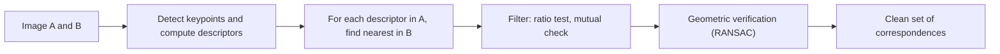

**Feature matching** pairs keypoints in one image with the keypoints in another that show the same physical point. Each keypoint carries a **descriptor**, a vector summarizing its neighbourhood ([[SIFT]] produces 128 numbers), and matching is a nearest-neighbour search in descriptor space.

## Distance Between Descriptors

| Descriptor | Typical distance |
| ---------- | ---------------- |
| Real-valued vectors (SIFT) | Euclidean ($L_2$) distance |
| Binary descriptors (such as ORB) | Hamming distance (number of differing bits) |

## Choosing Which Matches to Trust

Taking every keypoint's nearest neighbour gives many **wrong** matches, because a keypoint with no true counterpart (hidden, outside the view, or filtered out) still has *some* nearest neighbour.

| Strategy | Rule | Weakness |
| -------- | ---- | -------- |
| **Nearest neighbour only** | Accept the closest descriptor | Accepts all unmatched points too |
| **Distance threshold** | Accept if the distance is below $t$ | Some descriptors are distinctive and others generic, so no single $t$ fits |
| **Ratio test** | Accept if $d_1 / d_2 < 0.8$ ($d_1$ nearest, $d_2$ second nearest) | Rejects some correct matches |
| **Mutual (cross) check** | Keep $a \leftrightarrow b$ only if each is the other's nearest | Fewer matches |

### The ratio test

A correct match should be **much closer** than any other candidate. A wrong match has no good counterpart, so its nearest and second-nearest are about equally far and the ratio is near 1. Lowe measured, for SIFT, that rejecting matches with a ratio above 0.8 **removes 90% of the false matches while losing fewer than 5% of the correct ones**.

An experiment on a photograph and a copy of it rotated 30 degrees and scaled to 0.7, where the true mapping is known, shows the effect. A match counts as correct when its position agrees with the known transform to within 3 pixels:

| Method | Matches | Correct |
| ------ | ------- | ------- |
| Nearest neighbour only | 2754 | 994 (36%) |
| **Ratio test, 0.8** | 1007 | **954 (95%)** |
| After RANSAC (homography, 3 px) | 954 | 954 (inliers) |

The ratio test turns a mostly wrong match set into a mostly right one, and RANSAC removes the last mistakes.

## Geometric Verification

Even good matches contain mistakes, so a final check asks that the matches **agree on a geometric model**: a homography for a plane or a rotating camera ([[Homographies and Perspective Warping]]), or a fundamental matrix for a general scene. [[RANSAC]] fits the model to random minimal samples of matches and keeps the largest consensus. Lowe's own system clustered matches by pose with a Hough transform and then verified the result by least squares.

## Fast Search

Exact nearest-neighbour search in 128 dimensions is no faster than checking every candidate, since tree indexes lose their advantage above roughly 10 dimensions. Approximate methods return the true neighbour with high probability, such as Lowe's **Best-Bin-First** variant of k-d trees. Libraries provide this as FLANN-style search, and for a few thousand keypoints a brute-force distance matrix is fine ([[SIFT and Matching Snippets]]).

## Related Matching Ideas

This is the keypoint counterpart of [[Template Matching]]: instead of sliding a patch over every position, compare compact descriptors of a few distinctive points, which is faster and tolerates scale and rotation.

*Sources: Lowe, [Distinctive Image Features from Scale-Invariant Keypoints, IJCV 2004](https://www.cs.ubc.ca/~lowe/papers/ijcv04.pdf), for the 0.8 ratio, the 90% and 5% figures, Best-Bin-First and the Hough clustering; the Hamming remark and mutual check are from my own knowledge. The results table comes from my own run of OpenCV's SIFT on an example photograph.*

---
*Related:* [[Computer Vision MOC]], [[SIFT]], [[RANSAC]], [[Homographies and Perspective Warping]], [[SIFT and Matching Snippets]]
