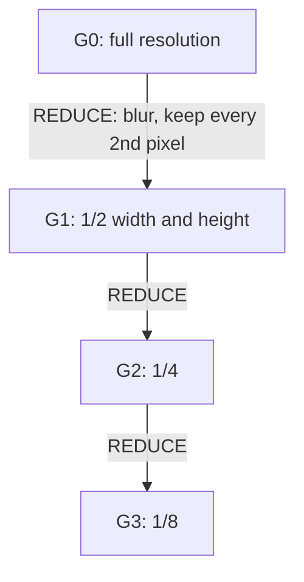

An **image pyramid** is a collection of the same image at progressively lower resolutions, stacked like a pyramid: full size at the bottom, each level above it smaller. It is the standard data structure for analysing an image **at multiple scales**, because an object, edge or texture that is too big for a fixed-size window at one level fits comfortably at another.

![[image-pyramid-example.png]]

*Top row: a Gaussian pyramid of a sample map image (each level is half the width and height). Bottom row: the Laplacian levels, which keep only the detail lost between neighbouring Gaussian levels (contrast boosted 4x).*

## Gaussian Pyramid

Build each level by **blurring** the previous one and then **keeping every second pixel**:

$$G_{l+1} = \text{REDUCE}(G_l) = \text{subsample}_2\big(g_\sigma * G_l\big)$$

- The blur must come first to prevent **aliasing** ([[Aliasing and Downsampling]]). Burt and Adelson used a small separable 5-tap binomial kernel, $\tfrac{1}{16}[1, 4, 6, 4, 1]$, a close approximation of a Gaussian ([[Gaussian Filtering and Convolution]]).
- **Storage is cheap.** Each level has a quarter of the pixels of the one below, so the whole pyramid costs $1 + \tfrac14 + \tfrac1{16} + \dots \to \tfrac43$ of the original image.
- The opposite operation, **EXPAND**, upsamples by 2 and interpolates ([[Image Interpolation]]) to fill the new pixels.

## Laplacian Pyramid

A **Laplacian pyramid** stores what each Gaussian level has that the next coarser level lacks:

$$L_l = G_l - \text{EXPAND}(G_{l+1}), \qquad L_{top} = G_{top}$$

Each $L_l$ is a **band-pass** image: mostly zeros with detail at one scale (edges and texture), which makes it highly compressible. The image can be rebuilt **exactly** by working back down: $G_l = L_l + \text{EXPAND}(G_{l+1})$. Burt and Adelson introduced it in 1983 as a compact image code.

| | Gaussian pyramid | Laplacian pyramid |
| --- | --- | --- |
| Each level holds | A blurred, smaller copy of the image | The detail between two Gaussian levels |
| Looks like | A low-resolution photo | Edges on a grey background |
| Typical use | Multi-scale search, coarse-to-fine | Compression, blending, detail enhancement |

## What Pyramids Are Used For

- **Searching at multiple scales:** a fixed-size template or detector can find a target that appears larger, because some level shrinks it to the template's size ([[Multi-Scale Template Matching]]). Sliding-window face and object detectors work the same way.
- **Coarse-to-fine search:** match at a low resolution first, then refine only near the match at higher resolutions. A full-resolution search covers a small region instead of the whole image, which cuts the $O(HWhw)$ cost of [[Template Matching]].
- **Optical flow and image registration:** large motions look small at coarse levels, so estimate them there and refine downward.
- **Blending:** blend two images level by level in a Laplacian pyramid to hide seams (the classic "apple-orange" mosaic).
- **Feature detection:** [[SIFT]] looks for keypoints across a scale space built from progressively blurred images, grouped into octaves of the same kind of halving.

## Single-Blur Shortcut vs. a True Pyramid

A common shortcut in multi-scale matching is to **blur once** (say $\sigma = 1$) and then subsample that same blurred image by 2 and by 4 (`[::2, ::2]` and `[::4, ::4]`), as in [[Multi-Scale Template Matching]]. This is pyramid-like but not a textbook Gaussian pyramid. A true pyramid blurs again at each level, so the 4x level gets more total smoothing. That is why $\sigma = 1$ is arguably small for the 4x step.

*Sources: [Foundations of Computer Vision, ch. 23: Image Pyramids](https://visionbook.mit.edu/pyramids_new_notation.html), which builds each level with the fourth binomial filter and shows the Laplacian pyramid is invertible when the low-pass residual is kept; [Burt and Adelson, The Laplacian Pyramid as a Compact Image Code (1983)](https://courses.cs.washington.edu/courses/cse576/03sp/readings/pyramid83.pdf); background in [Szeliski, Computer Vision: Algorithms and Applications, ch. 3](https://szeliski.org/Book/). The 4/3 storage figure follows from the geometric series.*

---
*Related:* [[Computer Vision MOC]], [[Gaussian Filtering and Convolution]], [[Aliasing and Downsampling]], [[Multi-Scale Template Matching]]
