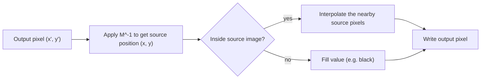

**Image warping** moves the pixels of an image according to a geometric transformation: shifting, rotating, scaling, shearing or bending it. It is the geometric counterpart of [[Pixel-Level Operations]], which change pixel *values* but leave positions alone. Warping changes **where** pixels are, and it is the basis of image alignment, panoramas, document rectification and augmented reality.

![[image-warping-transforms.png]]

*One test image under each transformation covered below. Straight grid lines stay straight in all of them, but only some keep parallel lines parallel.*

## Homogeneous Coordinates

A 2D point $(x, y)$ is written as the 3-vector $(x, y, 1)^\top$. This lets **every** transformation below, including translation, be a single $3 \times 3$ matrix multiplication:

$$\begin{pmatrix} x' \\ y' \\ w' \end{pmatrix} = M \begin{pmatrix} x \\ y \\ 1 \end{pmatrix}, \qquad (x_{out}, y_{out}) = \left(\frac{x'}{w'},\ \frac{y'}{w'}\right)$$

For all transformations except the perspective one, $w' = 1$ and the division does nothing. Chains of transformations become matrix products, and an inverse transformation is the matrix inverse.

## The Basic Transformations

| Transformation | Matrix $M$ | Parameters | What it does |
| -------------- | ---------- | ---------- | ------------ |
| **Translation** | $\begin{pmatrix} 1 & 0 & t_x \\ 0 & 1 & t_y \\ 0 & 0 & 1 \end{pmatrix}$ | $t_x, t_y$ | Shifts every pixel by the same amount |
| **Rotation** by $\theta$ | $\begin{pmatrix} \cos\theta & -\sin\theta & 0 \\ \sin\theta & \cos\theta & 0 \\ 0 & 0 & 1 \end{pmatrix}$ | $\theta$ | Turns the image about the origin |
| **Uniform scaling** | $\begin{pmatrix} s & 0 & 0 \\ 0 & s & 0 \\ 0 & 0 & 1 \end{pmatrix}$ | $s$ | Enlarges or shrinks, keeping the shape |
| **Non-uniform scaling** | $\begin{pmatrix} s_x & 0 & 0 \\ 0 & s_y & 0 \\ 0 & 0 & 1 \end{pmatrix}$ | $s_x, s_y$ | Stretches one axis more than the other and changes the aspect ratio |
| **Shear** (horizontal) | $\begin{pmatrix} 1 & h & 0 \\ 0 & 1 & 0 \\ 0 & 0 & 1 \end{pmatrix}$ | $h$ | Slides rows sideways in proportion to their height |

Notes:

- With the image $y$ axis pointing **down**, a positive angle looks like a clockwise turn on screen.
- A **negative** scale factor mirrors the image.
- Rotation and scaling act about the **origin**, which is the top-left corner of an image. To turn or scale about the centre $\mathbf c$, shift it to the origin, transform, and shift back: $M = T(\mathbf c)\, R(\theta)\, T(-\mathbf c)$.
- **Order matters.** Matrices apply right to left, so $M = T R S$ scales first, then rotates, then translates. Rotating then translating gives a different result from translating then rotating, because matrix multiplication is not commutative.

## Affine Transformations

An **affine** transformation is any combination of the above:

$$M = \begin{pmatrix} a & b & t_x \\ c & d & t_y \\ 0 & 0 & 1 \end{pmatrix}, \qquad \begin{aligned} x' &= a x + b y + t_x \\ y' &= c x + d y + t_y \end{aligned}$$

It has **6 degrees of freedom**, so **3 non-collinear point correspondences** (3 pairs give 6 equations) determine it exactly, and more pairs are solved by least squares.

- **Preserves:** straight lines, **parallelism**, and ratios of lengths along a line (the midpoint stays the midpoint).
- **Does not preserve:** lengths or angles, in general. A square becomes a parallelogram.

## The Hierarchy of 2D Transformations

Each class contains the ones above it, and each one preserves less:

| Class | Degrees of freedom | Preserves |
| ----- | ------------------ | --------- |
| Translation | 2 | Everything except position (orientation, lengths, angles) |
| Rigid (rotation + translation) | 3 | Lengths and angles |
| Similarity (adds uniform scale) | 4 | Angles and length ratios |
| **Affine** | 6 | Parallel lines and ratios along lines |
| **Projective (homography)** | 8 | Straight lines only: see [[Homographies and Perspective Warping]] |

Cylindrical warping is not in this table, because it is a non-linear mapping and cannot be written as a $3 \times 3$ matrix: see [[Cylindrical Warping]].

## Forward vs. Inverse Warping

There are two ways to apply a transformation to an image:

| | Forward warping | **Inverse warping** |
| --- | --- | --- |
| Loop over | Source pixels | **Output pixels** |
| For each | Compute where it lands: $\mathbf x' = M \mathbf x$ | Compute where it came from: $\mathbf x = M^{-1} \mathbf x'$ |
| Problem | Output **holes** and overlaps, because landing positions are not integers | Source position is not an integer, so it needs **interpolation** |
| Verdict | Rarely used for images | **Standard** |

- **Interpolation:** the source position is fractional, so the value is blended from its neighbours ([[Image Interpolation]]). Nearest neighbour is blocky, bilinear is the usual compromise.
- **Output size:** transform the four corners of the source to find the bounding box of the result, and add a translation so nothing lands at negative coordinates.
- **Shrinking:** a large downscale needs a low-pass filter first, otherwise aliasing appears ([[Aliasing and Downsampling]]).
- **Repeated warps:** every warp resamples and slightly blurs the image, so compose the matrices first and warp **once** from the original.

Code: [[Image Warping Snippets]].

*Sources: Torralba, Isola and Freeman, [Foundations of Computer Vision, ch. 38 (homogeneous coordinates and the transformation hierarchy)](https://visionbook.mit.edu/homogeneous_coordinates.html), which also describes forward mapping's holes and artifacts versus backward mapping; [Affine transformation (Wikipedia)](https://en.wikipedia.org/wiki/Affine_transformation); Szeliski, [Computer Vision: Algorithms and Applications](https://szeliski.org/Book/), chapters on image transformations. The figure and the parameter counts were checked with my own implementation.*

---
*Related:* [[Computer Vision MOC]], [[Homographies and Perspective Warping]], [[Cylindrical Warping]], [[Image Interpolation]], [[Image Warping Snippets]]
