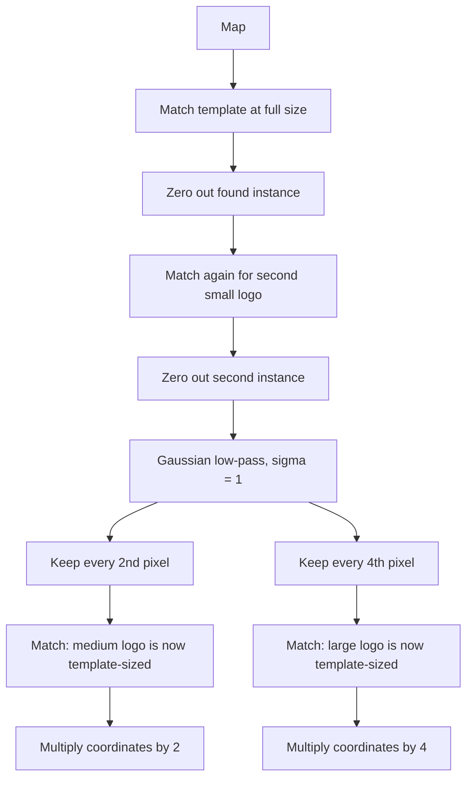

A template has a fixed size, but the object in a scene can appear at several sizes. **Multi-scale template matching** handles this without resizing the template: **shrink the image** until the target matches the template's size, then run the normal search from [[Template Matching]].

## The Problem

Consider a map image containing the same logo **four times**, blended in after each copy received its own unknown affine intensity change $I' = aI + b$:

| Instance | Size relative to template | Count |
| -------- | ------------------------- | ----- |
| Small | 1x (38 x 32, the template) | 2 |
| Medium | 2x in width and height | 1 |
| Large | 4x in width and height | 1 |

The search function returns only the **single best location**, so finding the second small logo needs extra work.

## Pipeline

1. Match the small template at full resolution to find the small instances. SAD and NCC agreed on the first, and NCC was the right choice for the second.
2. **Zero out** (set to 0) each found instance so it cannot be returned again.
3. Apply a **Gaussian low-pass filter** ([[Gaussian Filtering and Convolution]]) to the map.
4. **Downsample by 2** with `[::2, ::2]`. The medium logo is now template-sized, so run SAD and NCC.
5. **Map coordinates back** by multiplying by 2.
6. Repeat with downsampling by 4 and multiply the coordinates by 4.

The low-pass step before subsampling is not optional: see [[Aliasing and Downsampling]].

![[multiscale-matching-pipeline.png]]

## Results

All four logos were found by NCC. SAD found only the first small instance.

| Search | SAD | NCC | Outcome |
| ------ | --- | --- | ------- |
| Small #1 (full map) | (100, 320), cost 29636 | (100, 320), score 0.9250 | Agree |
| Small #2 (after removing #1) | (10, 164), cost 36081 | **(430, 250)**, score 0.5931 | NCC correct |
| Medium (2x map) | (13, 51), cost 37957 | **(100, 125)**, score 0.5735 | NCC correct, original **(200, 250)** |
| Large (4x map) | (119, 34), cost 39882 | **(75, 15)**, score 0.6076 | NCC correct, original **(300, 60)** |

## Why NCC Wins Here

Each logo was blended into the map with its own unknown $a$ and $b$, so no logo is a pixel-exact copy of the template. SAD compares absolute intensities and is fragile to that change, whereas ZNCC subtracts the mean and divides by the norm, so it is invariant to $aI + b$ (for $a > 0$). That makes the pattern, not the brightness, decide the match. Blurring and subsampling also make the shrunken logo only approximately equal to the template, which plausibly favours a pattern-based score again.

## Finding the Second Instance

The search returns one best location, so the first result is **removed** (its window set to 0) and the search is repeated.

- Removal also matters at the downsampled scales. A leftover small logo would be shrunk into something similar to the template and could outscore the real medium or large logo, especially for SAD.
- It only works because the number of instances is known in advance (two small, one medium, one large). The approach is **greedy**: find the best match, remove it, repeat.
- **General approach:** compute the **score map** for the whole image, **threshold** it, and apply **non-maximum suppression** ([[Non-Maximum Suppression]]) to keep one detection per local peak. This works for an unknown number of instances. Scores in this code are already stored at the window's top-left corner, so no coordinate adjustment is needed.

## Caveats

- Mapped-back coordinates are approximate: one pixel at the 2x or 4x scale equals 2 or 4 original pixels, so the error can be a few pixels. The bounding box in the original image is 2x or 4x the template size.
- Both low-pass filters used $\sigma = 1$. That worked, but $\sigma = 1$ is arguably small for the 4x step; the rule of thumb is $\sigma \approx \text{factor}/2$.
- Matching at several scales by shrinking the image is the idea behind **image pyramids** ([[Image Pyramids]]). Here the map is blurred once and subsampled at 2 and 4, rather than blurred again at each level.
- Only **scale** is handled. Rotation, perspective and occlusion still break matching ([[Template Matching]]).

*Source: [Foundations of Computer Vision, ch. 23: Image Pyramids](https://visionbook.mit.edu/pyramids_new_notation.html) discusses changing the image size rather than the template size for multi-scale detection.*

---
*Related:* [[Computer Vision MOC]], [[Template Matching]], [[Aliasing and Downsampling]], [[Image Pyramids]], [[Template Matching Snippets]]
