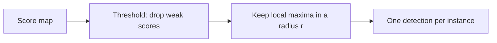

**Non-maximum suppression (NMS)** keeps only the strongest response in each neighbourhood and discards (suppresses) the weaker ones around it. A detector rarely fires once per object: nearby windows or boxes all score highly, so without NMS one object produces a cluster of duplicate detections.

## Two Common Forms

| Form | Input | Rule |
| ---- | ----- | ---- |
| **Score map** (template matching, edges, corners) | A 2D map of scores, one per window position | Keep a pixel only if it is the maximum within its neighbourhood and above a threshold |
| **Bounding boxes** (object detection) | A list of boxes with confidence scores | Keep the top box, drop boxes that overlap it too much, repeat |

### On a score map

This is the general fix for multiple instances in [[Multi-Scale Template Matching]]: compute the **score map** for the whole image, **threshold** it, then keep one detection per **local peak**.

The radius should be about the template size, so two detections cannot sit on the same object.

**Corner response maps** use the smallest case: compare each pixel with its 8 neighbours in a $3 \times 3$ window and keep it only if it is the maximum and above a relative threshold. Corners are isolated points, so a window this small is enough. With `>=` the ties on a flat plateau are all kept, while a strict `>` would drop them all, so the choice decides what happens to equal neighbours ([[Harris Corner Detector]]). Edge detectors use the same idea along the gradient direction to thin edges to one pixel.

### On bounding boxes (greedy NMS)

Overlap is measured by **intersection over union**:

$$\text{IoU}(A, B) = \frac{|A \cap B|}{|A \cup B|}$$

1. Sort boxes by confidence score.
2. Take the best box and add it to the output.
3. Remove every remaining box whose IoU with it exceeds a threshold (commonly 0.45 to 0.65).
4. Repeat with the next best remaining box until none are left.

**Limitation:** a fixed threshold can wrongly suppress a genuine neighbour in crowded scenes, since overlap is treated as all-or-nothing. Variants such as Soft-NMS lower the score instead of deleting the box.

## Versus "Remove and Repeat"

A simpler alternative is **greedy remove-and-repeat**: find the best match, zero out its window, search again. That is NMS in spirit, but it needs the number of instances in advance and re-runs the whole search each time. Score-map NMS runs the search once.

Code for both forms: [[Template Matching Snippets]].

*Sources: [Datature glossary: Non-Maximum Suppression](https://datature.io/glossary/non-maximum-suppression-nms); [Hosang et al., Learning non-maximum suppression](https://arxiv.org/pdf/1705.02950).*

---
*Related:* [[Computer Vision MOC]], [[Template Matching]], [[Multi-Scale Template Matching]], [[Harris Corner Detector]], [[Corner Detection Snippets]]
