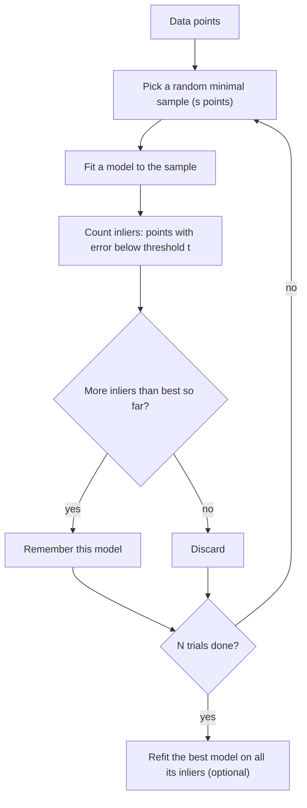

**RANSAC** (RANdom SAmple Consensus; Fischler and Bolles, 1981) fits a model to data in which a large fraction of points may be **outliers**. Instead of using all points, it repeatedly fits the model to a tiny random sample and keeps the model that **most points agree with**. Points that fit are **inliers**; the rest are **outliers**.

## Algorithm

1. Choose a **minimal sample** of $s$ points, the fewest that determine the model: **2** for a line, 3 for a circle, 4 for a homography.
2. Fit the model to the sample. For a line, use [[Least-Squares Line Fitting]], which for two points gives an exact line.
3. Compute each point's error to the model and count the **inliers** (error below a threshold $t$).
4. Repeat for $N$ trials and keep the model with the largest consensus set.
5. Optionally **refit** on all of that model's inliers for a more accurate result.

**Example:** with 100 inliers (noise $\sigma = 1.5$) and 100 uniform outliers, ordinary least squares fails while RANSAC (100 trials, threshold $2\sigma = 3$) counts 99 of the 100 true inliers and recovers the line after a refit. The comparison figure is in [[Least-Squares Line Fitting]].

## Parameters

### Threshold $t$

Point-to-line error is the perpendicular distance $|ax + by + c|$ when $(a, b)$ is a unit vector. If inlier noise is Gaussian with standard deviation $\sigma$, a threshold of $t$ keeps this fraction of true inliers:

| $t$ | Fraction of inliers kept |
| --- | ------------------------ |
| $0.5\sigma$ | 38% |
| $1.0\sigma$ | 68% |
| $1.96\sigma$ | 95% |
| $2.58\sigma$ | 99% |

- **Too small:** many true inliers are rejected, and the model looks less supported.
- **Too large:** outliers close to the line are accepted, and different models tie.
- A common choice is $t \approx 2\sigma$. With $t = 0.33\sigma$ the expected fraction is about 26%, so on 100 inliers a count near 25 is exactly what the table predicts.

With $\sigma = 0$ (noise-free data) any small threshold works, and any two true inliers give the exact line.

### Number of trials $N$

Let $w$ be the **inlier ratio**. One trial draws an all-inlier sample with probability $w^s$. To be $p$ sure (say 99%) of at least one clean sample:

$$N = \frac{\ln(1 - p)}{\ln(1 - w^s)}$$

| Inlier ratio $w$ | $s = 2$ (line) | $s = 4$ (homography) |
| ---------------- | -------------- | -------------------- |
| 0.5 | 17 | 72 |
| 0.3 | 49 | 567 |
| 0.1 | 459 | many thousands |

More outliers and bigger samples both **raise** the number of trials sharply. A worked case: 10 true inliers among 25 points. The chance a random pair is two inliers is $\binom{10}{2} / \binom{25}{2} = 45/300 = 0.15$, so 150 trials miss with probability $0.85^{150} \approx 3 \times 10^{-11}$.

## Properties

| Strength | Weakness |
| -------- | -------- |
| Tolerates a large fraction of outliers (even above 50%) | **Non-deterministic**: two runs can differ |
| Simple, and works for any model with a minimal solver | Needs a good threshold, usually tied to the noise level |
| Final refit gives least-squares accuracy | Cost grows quickly as inlier ratio falls or sample size rises |

## Multiple Models

To find several lines, run RANSAC, **remove the inliers** of the best line, and repeat on what remains. This is the same greedy remove-and-repeat idea as in [[Non-Maximum Suppression]] and [[Multi-Scale Template Matching]], and it needs a stopping rule (for example a minimum inlier count). Voting methods such as the Hough transform are the main alternative.

## Why Use RANSAC

Real measurements are rarely clean. Some points are **gross errors**: a wrong feature match, a sensor glitch, a moving object in a static scene, a mistyped value. Standard estimators such as least squares weigh every point, so a few bad ones can ruin the result ([[Least-Squares Line Fitting]]). RANSAC is used because it:

- **Tolerates a large share of outliers**, even more than half, which most robust statistics cannot.
- **Does not need to know which points are bad** in advance. It discovers them by consensus, and returns the inlier set as a by-product (a free segmentation).
- **Works for any model** that can be fitted from a small sample, so one loop covers lines, planes, circles, homographies and camera poses.
- **Is simple and parallel**: each trial is independent and cheap, since it fits only a minimal sample.
- **Ends with an accurate fit**, because the final refit uses only inliers.

## Where It Is Used

| Area | Typical task | Model |
| ---- | ------------ | ----- |
| Computer vision | Panorama stitching and image registration from feature matches ([[Homographies and Perspective Warping]]) | Homography |
| Computer vision | Verifying keypoint matches ([[Feature Matching]]) in stereo, structure from motion, visual odometry | Fundamental or essential matrix, camera pose |
| Computer vision | Lane markings, vanishing points, straight edges | Lines |
| 3D sensing (lidar, depth cameras) | Ground or wall detection, plane extraction from point clouds | Plane |
| Robotics | Localization and mapping with noisy landmark matches | Pose, transform |
| Mapping and surveying | Extracting roofs and terrain from aerial lidar | Planes, surfaces |
| Medical and 3D scanning | Aligning scans or surfaces despite spurious points | Rigid transform |
| General data analysis | Calibration or regression when some readings are faulty | Lines, curves |

The method comes from a computer vision setting: Fischler and Bolles introduced it for image analysis and automated cartography, where feature matches between images are always contaminated by mistakes.

### Examples in General Data Analysis

- **Sensor calibration:** fit reading vs. true value when a few readings are stuck, spiking or taken while the sensor was disconnected.
- **Data-entry errors:** fit price vs. floor area when a few listings have a slipped decimal or wrong unit. The rejected rows are the ones to inspect.
- **Lab and field measurements:** recover the underlying relationship when a few runs were contaminated or mis-set.
- **GPS tracks:** fit a straight path despite occasional jumps caused by signals bouncing off buildings.
- **Mixed populations:** fit the dominant group when a minority follows a different process.

For regression with only a few mild outliers, Huber regression or Theil-Sen are simpler and deterministic, and RANSAC pays off when the outlier share is large or arbitrary. Rejected points are not always errors, since sometimes they are the interesting signal, so inspect them before discarding.

## Is RANSAC a Smoothing Algorithm?

Not really. It is **robust model fitting**, which has a different goal and output from smoothing:

| | Smoothing (Gaussian, moving average, median) | RANSAC |
| --- | --- | --- |
| Assumption | The signal varies slowly or locally | A **global parametric model** explains most of the data |
| Works | Locally, in a window around each point | Globally, on the whole data set |
| Output | A cleaned signal of the same size | **Model parameters** and an **inlier mask** |
| Handles | Small random noise (median also handles spikes) | **Gross outliers**; small noise on inliers is left as is |

RANSAC does not remove ordinary noise on the inliers. What reduces it is the final **least-squares refit**, which averages the noise over all inliers. Two links to smoothing:

- You can use the fitted model to **denoise**: replace outliers with their model values, or project points onto the fitted line. That is model-based cleaning rather than smoothing.
- In spirit it is closest to the **median filter** ([[Median Filter]]): both resist outliers because the estimate depends on the majority, not on every value. A **robust local regression** (such as LOESS with outlier down-weighting) is the true smoothing counterpart.

## In Practice: Open-Source Systems and Research

Companies rarely publish their internal pipelines, but the open-source and academic systems that industry builds on show how RANSAC is used:

- **Visual SLAM (ORB-SLAM).** A moving camera must build a map and locate itself at the same time. To start, the system estimates the camera motion between two frames from matched features, computing a **homography** (for flat scenes) and a **fundamental matrix** (for general scenes) in parallel with a RANSAC-style scheme, then picks the model that explains the matches better. Wrong matches are unavoidable, so robust fitting is essential. *Source: [Mur-Artal et al., ORB-SLAM](https://arxiv.org/pdf/1502.00956).*
- **Structure from motion (COLMAP).** Photo collections are turned into 3D models by matching features across image pairs and keeping only pairs whose matches agree on a fundamental or homography model, which is a RANSAC consensus test. *Source: [COLMAP on GitHub](https://github.com/colmap/colmap), described in Schonberger and Frahm, Structure-from-Motion Revisited, CVPR 2016.*
- **Lidar ground removal for driving.** Self-driving research pipelines commonly fit the road as a plane in a lidar point cloud with RANSAC, then remove the points near it to leave obstacles. The Point Cloud Library offers a ready-made RANSAC plane segmenter for this. *Source: [Ground surface detection from sparse lidar, arXiv 2105.11649](https://arxiv.org/pdf/2105.11649).*

Library implementations make this routine: OpenCV's `findHomography` and `findFundamentalMat` both accept a RANSAC option, and scikit-learn has `RANSACRegressor`.

## RANSAC and Machine Learning

The idea transfers to learning, but the setting differs. In classic fitting the model is tiny (a line has 2 parameters), so a minimal sample of 2 points fits it. A learned model with thousands or millions of parameters cannot be fitted from a handful of samples, and refitting it for hundreds of trials is rarely affordable.

| Situation | What is used |
| --------- | ------------ |
| **Small models** (linear or polynomial regression, a shallow tree) | RANSAC wraps any estimator directly. scikit-learn's `RANSACRegressor` fits the estimator on random subsets and keeps the one with the most inliers. |
| **Data cleaning before training** | Fit a simple model with RANSAC, then drop or inspect the rejected points. |
| **Deep networks and noisy labels** | The same *consensus* idea appears as loss-based selection: samples with **small loss** are treated as likely clean and used for updates, as in [Co-teaching](https://arxiv.org/pdf/1804.06872). Robust losses (L1, Huber) and regularization give implicit robustness. |
| **Geometric parts of vision pipelines** | RANSAC is commonly kept after the network: a learned matcher proposes correspondences, and RANSAC can verify them with a geometric model. |
| **Training through RANSAC** | [DSAC](https://arxiv.org/pdf/1611.05705v1) makes hypothesis selection differentiable so a network can be trained end to end with RANSAC inside, and [NG-RANSAC](https://openaccess.thecvf.com/content_ICCV_2019/papers/Brachmann_Neural-Guided_RANSAC_Learning_Where_to_Sample_Model_Hypotheses_ICCV_2019_paper.pdf) learns where to sample so clean minimal sets are drawn more often. |

So the model often *does* handle outliers implicitly, through its loss and its capacity limits, but RANSAC remains the tool when the structure is an explicit geometric model that must satisfy hard constraints.

*Sources: [Random sample consensus (Wikipedia)](https://en.wikipedia.org/wiki/Random_sample_consensus); the same trial-count formula, applied to homography estimation, is derived in [Foundations of Computer Vision, ch. 41](https://visionbook.mit.edu/homography.html); Fischler and Bolles, Random Sample Consensus, Communications of the ACM, 1981. The inlier-fraction and trial-count tables are computed from the formulas above.*

---
*Related:* [[Computer Vision MOC]], [[Least-Squares Line Fitting]], [[RANSAC Snippets]]
