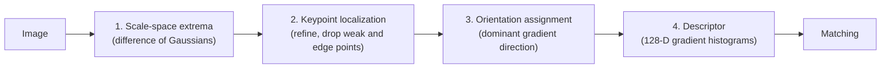

**SIFT** (Scale-Invariant Feature Transform; David Lowe, 1999 and 2004) finds distinctive **keypoints** in an image and describes each one with a **128-number vector** (a descriptor) that stays nearly the same when the image is **scaled or rotated** and is fairly robust to lighting change, noise and moderate viewpoint change. Two photos of the same scene can then be linked by matching their descriptors.

It fixes the main weakness of [[Harris Corner Detector]]: corners are found at one fixed window size, so a feature that looks like a corner at one scale looks like a smooth curve at another. SIFT searches over scale and records the scale of each keypoint.

![[sift-keypoints-example.png]]

*Keypoints on a photograph, drawn with their scale (circle size) and dominant orientation (line). Only every sixth of the 2754 detected keypoints is drawn.*

## Pipeline

## 1. Scale-Space Extrema Detection

Blur the image with Gaussians of increasing width to form a **scale space**, subtract neighbouring levels to get **difference-of-Gaussian (DoG)** images, and look for points that are a maximum or minimum of the DoG among their **26 neighbours** (8 in the same level, 9 in the level above, 9 in the level below). The scale of the level where the extremum occurs is the keypoint's **characteristic scale**.

Settings in Lowe's paper: **3 scale intervals per octave** ($s = 3$, $k = 2^{1/s}$), a base blur of $\sigma = 1.6$, and the input image **doubled** in size first to keep fine detail. Details and a worked blob example: [[Scale Space and Difference of Gaussians]].

## 2. Keypoint Localization

Each candidate is refined and filtered:

- **Sub-pixel and sub-scale position:** a quadratic (Taylor) fit to the DoG around the sample point gives the true extremum position.
- **Low contrast removed:** extrema with $|D(\hat{\mathbf x})| < 0.03$ are discarded (pixel values scaled to $[0, 1]$), since they are unstable under noise.
- **Edge responses removed:** a DoG peak along an edge is strong in one direction and weak across it, so its position slides along the edge. Using the $2 \times 2$ Hessian $H$ of the DoG, with $r$ the ratio of its two eigenvalues, a keypoint is kept only if

$$\frac{\operatorname{Tr}(H)^2}{\operatorname{Det}(H)} < \frac{(r + 1)^2}{r}, \qquad r = 10$$

This is the same ratio-of-curvatures idea that Harris uses to tell edges from corners. In the paper's example, the contrast filter reduces 832 candidates to 729 and the edge filter to **536**.

## 3. Orientation Assignment

To make the keypoint **rotation invariant**, everything is measured relative to a **dominant gradient direction**. At the keypoint's scale, gradient magnitude and direction come from pixel differences of the blurred image $L$:

$$m(x, y) = \sqrt{\big(L(x{+}1, y) - L(x{-}1, y)\big)^2 + \big(L(x, y{+}1) - L(x, y{-}1)\big)^2}, \qquad
\theta(x, y) = \operatorname{atan2}\big(L(x, y{+}1) - L(x, y{-}1),\ L(x{+}1, y) - L(x{-}1, y)\big)$$

- Build a **36-bin histogram** (10 degrees per bin) of $\theta$ in a region around the keypoint, weighting each sample by $m$ and by a Gaussian window with $\sigma$ equal to **1.5 times the keypoint's scale**.
- The **highest peak** gives the orientation. Any other peak within **80%** of it creates an **additional keypoint** at the same place with that orientation (about 15% of points get several).
- A parabola fitted to the three bins around a peak refines the angle.

## 4. The Descriptor

1. Sample gradients in a **16 x 16** window around the keypoint at its scale, with directions **rotated relative to the keypoint orientation**.
2. Weight them with a Gaussian of $\sigma$ equal to half the window width, so samples far from the centre matter less.
3. Split the window into **4 x 4 sub-regions** and build an **8-bin orientation histogram** in each (weighted by magnitude, with **trilinear interpolation** so a sample that moves slightly does not jump between bins).
4. Concatenate: $4 \times 4 \times 8 = \mathbf{128}$ numbers.
5. **Normalize** to unit length, **clip** each entry to at most 0.2, and renormalize.

Why this gives invariance:

| Change | Why the descriptor survives |
| ------ | --------------------------- |
| Scale | Gradients are sampled at the keypoint's own scale |
| Rotation | Directions are measured relative to the keypoint orientation |
| Contrast (multiply by a constant) | Gradients scale by the constant, and unit-length normalization cancels it |
| Brightness (add a constant) | Gradients ignore a constant offset |
| Non-linear lighting effects | The 0.2 clip stops a few very large gradients from dominating |
| Small position errors | Histograms pool over sub-regions, and the Gaussian weight fades the window edges |

## Matching Keypoints

Descriptors from two images are compared by **Euclidean distance**, and a match is accepted only when the nearest neighbour is clearly closer than the second nearest. Details: [[Feature Matching]].

![[sift-matching-example.png]]

*A photograph and a copy rotated 30 degrees and scaled to 0.7: 2754 and 1745 keypoints respectively. After the ratio test, 1007 matches remain, and RANSAC keeps 954 consistent with a single homography.*

## Properties and Limits

- **Dense and distinctive:** a typical 500 x 500 image gives about 2000 stable features, while the 800 x 531 example above gave 2754.
- **Not fully affine or perspective invariant:** it tolerates moderate viewpoint change (Lowe tested a 30 degree depth rotation) but degrades beyond that. Later detectors add affine adaptation.
- **Needs texture:** blank regions and repeated patterns (windows on a facade) produce few or ambiguous keypoints.
- **Cost:** building the scale space and 128-D descriptors is heavier than corner detection. Faster alternatives exist: SURF, which uses [[Integral Images]] for box-filter approximations of the derivatives, and ORB, which uses binary descriptors. Learned detectors and descriptors now often outperform SIFT in hard conditions, but SIFT remains a common baseline.
- SIFT is patented (the original patent has since expired, and it is included in current OpenCV releases).

## Where It Is Used

Image stitching and panoramas ([[Homographies and Perspective Warping]]), structure from motion and SLAM, object recognition and image retrieval, and 3D reconstruction pipelines. In all of them the matches are noisy, so a geometric check with [[RANSAC]] follows.

*Sources: Lowe, [Distinctive Image Features from Scale-Invariant Keypoints, IJCV 2004](https://www.cs.ubc.ca/~lowe/papers/ijcv04.pdf), for every parameter and number quoted from the paper (26 neighbours, 3 scales per octave, sigma 1.6, contrast threshold 0.03, r = 10, 36 bins, 80% peaks, 128 dimensions, 0.2 clip). The keypoint, match and RANSAC counts come from my own run of OpenCV's SIFT on the example photograph. The patent and OpenCV remarks are from my own knowledge.*

---
*Related:* [[Computer Vision MOC]], [[Scale Space and Difference of Gaussians]], [[Feature Matching]], [[Harris Corner Detector]], [[Image Gradients and the Sobel Operator]], [[SIFT and Matching Snippets]]
