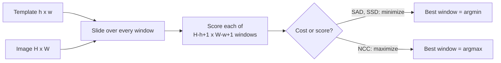

Template matching answers one question: **where does a small template (h x w) best match inside a larger image (H x W)?** The method slides the template over every position, computes a similarity score or a cost at each, and reports the best one. The location is the window's **top-left corner (x, y)**, where x indexes columns and y indexes rows.

![[template-matching-clean-example.png]]

*Example: a 38 x 32 logo template is found in a 150 x 300 image at (200, 50). The same logo also appears at (50, 60), and finding either counts.*

Brute-force cost is $O\big((H-h+1)(W-w+1)\cdot hw\big) \approx O(HWhw)$: every window position times every template pixel. SAD is cheaper per window than NCC, but both share the same loop structure. Common speedups:

- **FFT:** correlation becomes multiplication in the frequency domain ([[Cross-Correlation and Convolution]]).
- **Integral images** (summed-area tables): fast window sums and norms ([[Integral Images]]).
- **Coarse-to-fine search** on a pyramid ([[Image Pyramids]]).

## Intensity Model

Lighting and exposure changes are modeled as an **affine intensity change**:

$$I' = a \cdot I + b$$

| Parameter | Name | Effect on a patch |
| --------- | ---- | ----------------- |
| **b** (additive offset) | Brightness | Shifts every pixel equally. The mean changes, the spread does not. |
| **a** (multiplicative gain) | Contrast, gain, exposure | Scales the differences between pixels. The standard deviation scales by a, and the mean moves to a * mean. |

"Multiplicative brightness", "gain" and "exposure" are different names for the same operation as contrast. Whether a matching measure survives this model is the main axis for choosing between them.

## Similarity Measures

Let $W$ be the window under consideration and $T$ the template, both flattened over the same $(i, j)$ positions.

### SAD (Sum of Absolute Differences)

$$\text{SAD}(x, y) = \sum_{i,j} \big| W(i,j) - T(i,j) \big|$$

- **Minimize.** Lower means more similar, and 0 is a perfect match.
- This is the L1 distance. Cheap: a subtraction, an absolute value and a sum per pixel.
- Not invariant to brightness or contrast, since a global intensity change alters every term.
- Best when the template appears **exactly** as in the image (same lighting, little noise). Common in real-time block matching such as video motion estimation and stereo.

### SSD (Sum of Squared Differences)

$$\text{SSD}(x, y) = \sum_{i,j} \big( W(i,j) - T(i,j) \big)^2$$

- **Minimize.** This is the squared L2 distance, and 0 is a perfect match.
- Squaring makes large errors count much more. A salt-and-pepper pixel can add up to $255^2 = 65{,}025$ to SSD but at most 255 to SAD, so SSD is **more sensitive to outliers** than SAD.
- No brightness or contrast invariance.

Expanding the square shows how SSD relates to correlation:

$$\text{SSD} = \sum W^2 - 2\sum W\,T + \sum T^2$$

- $\sum T^2$ is constant for a given template.
- $\sum W\,T$ is the **cross-correlation** (a dot product).
- $\sum W^2$ is the window's energy.

Minimizing SSD is therefore maximizing correlation while penalizing bright windows. Plain cross-correlation alone would favour bright windows, because a large $\sum W^2$ inflates the dot product, and that bias is the motivation for normalizing.

### NCC and ZNCC (Normalized Cross-Correlation)

$$\text{NCC}(x, y) = \frac{\sum_{i,j} (W - \bar W)(T - \bar T)}{\sqrt{\sum_{i,j} (W - \bar W)^2 \cdot \sum_{i,j} (T - \bar T)^2}}$$

- **Maximize.** The range is $[-1, 1]$ and 1 is a perfect match.
- **Geometric view:** flatten the zero-mean window and template into vectors. NCC is the **cosine of the angle** between them, $\frac{a \cdot b}{\lVert a \rVert \lVert b \rVert}$.
- In code the dot product is `np.sum(A * B)` (element-wise multiply, then sum). The denominator terms are squared norms, a vector dotted with itself.
- **Subtracting the means** removes the brightness offset b, and also the mean shift caused by a.
- **Dividing by the norms** removes the contrast gain a, because the zero-mean window becomes $a(W - \bar W)$ and its norm scales by a too.
- Together: invariant to $I' = aI + b$ for $a > 0$. For $a < 0$ the polarity is inverted and a perfect match scores $-1$.
- Real images are clipped to $[0, 255]$, so if a or b pushes pixels past the limits, clipping breaks the exact invariance.
- **Flat-window caveat:** a uniform window has a norm of about 0 and an unstable score, which is why code adds a small `epsilon = 1e-8` to the denominator.
- The template's mean and variance never change, so compute them once outside the loop.

What is usually called NCC in practice is strictly **ZNCC** (zero-mean NCC). Without mean subtraction, plain NCC is the cosine of the raw pixel vectors. Pixel values are all non-negative, so that cosine is high almost everywhere and bright flat regions score near 1 against anything.

Link between SSD and NCC: for zero-mean, unit-norm patches,

$$\text{SSD} = 2 - 2\,\text{NCC}$$

so minimizing SSD on normalized patches and maximizing NCC are the same thing.

### Zero-mean variants

**ZSAD** and **ZSSD** subtract each patch's mean first. That adds brightness-offset invariance but not contrast invariance. A useful shortcut for the NCC numerator is $\sum W(T - \bar T) = \sum (W - \bar W)(T - \bar T)$, because $\sum \bar W (T - \bar T) = 0$, so only the template needs to be zero-mean there.

This is a different idea from a zero-mean *filter kernel*, covered in [[Gaussian Filtering and Convolution]].

## Comparing the Measures

| Measure | Optimize | Brightness offset (+b) | Contrast scale (x a) | Outlier sensitivity |
| ------- | -------- | ---------------------- | -------------------- | ------------------- |
| SAD | min | no | no | lower (L1) |
| SSD | min | no | no | higher (L2) |
| ZSAD / ZSSD | min | **yes** | no | same as base |
| Cross-correlation | max | no | no | biased to bright windows |
| NCC (no mean) | max | no | **yes** | |
| ZNCC (called NCC here) | max | **yes** | **yes** | |

### SAD vs. NCC: when to use which

| | SAD | NCC |
| --- | --- | --- |
| Cost | Cheap | More expensive (means, norms, multiplications, a division) |
| Lighting or contrast change | Fragile | Robust (affine invariant) |
| Heavy noise | Fails earlier | Fails later |
| Best when | The template appears exactly, with the same lighting | Brightness or contrast differ, or the data is noisy |

## Experiment: Salt-and-Pepper Noise

In this worked example the clean image has the logo at (50, 60) and (200, 50). Noise was added by setting random pixels to 0 or 255, at a rate of 5% per step per mask, giving labels from 10% to 80%. A detection counts only if the returned corner is exactly a true location (**tolerance 0 px**). That is strict, since a one-pixel offset is marked as not detected; a tolerance of a few pixels would be more forgiving. Code: [[Template Matching Snippets]].

| Noise label | SAD (x, y) | SAD cost | Detected | NCC (x, y) | NCC score | Detected |
| ----- | ---------- | -------- | -------- | ---------- | --------- | -------- |
| 0% | (200, 50) | 958 | yes | (200, 50) | 0.9999 | yes |
| 10% | (200, 50) | 27288 | yes | (200, 50) | 0.5634 | yes |
| 20% | (50, 60) | 50231 | yes | (50, 60) | 0.3905 | yes |
| 30% | (200, 50) | 67075 | yes | (50, 60) | 0.2889 | yes |
| 40% | (100, 95) | 75682 | **no** | (200, 50) | 0.1914 | yes |
| 50% | (144, 72) | 78762 | no | (200, 50) | 0.1448 | yes |
| 60% | (125, 69) | 76626 | no | (19, 16) | 0.1389 | **no** |
| 70% | (245, 29) | 71028 | no | (250, 56) | 0.1159 | no |
| 80% | (125, 11) | 59671 | no | (121, 85) | 0.1411 | no |

**Read the labels carefully.** Salt and pepper were applied as two independent masks, each at rate `0.05*i`, so the real corrupted fraction is about $1 - (1-p)^2$, roughly double the label. The "40%" row is about 64% corrupted and the "60%" row about 84%. Details and the full conversion table: [[Median Filter]].

![[template-matching-noise-detection.png]]

![[template-matching-noise-sweep.png]]

**SAD breaks first (40%), NCC at 60%.**

- **Why SAD fails:** every corrupted pixel adds a large error (up to 255) at every window position, including the correct one. Around 40% the cost at the true location is barely lower than at wrong locations, so SAD cannot separate them. Under heavy noise it tends to favour windows whose average intensity resembles the template's.
- **Why NCC lasts longer:** it compares the *pattern* across the window rather than absolute pixel values, so the logo's structure still correlates with the template. It is more robust but not immune: its best score falls from 0.56 at 10% to 0.14 at 50%.
- **Common mistake:** salt-and-pepper noise is **not** a brightness or contrast change, so NCC's affine invariance is *not* the explanation for its better noise performance. The explanation is the pattern-level comparison.
- **Prediction, not a result:** SSD is more outlier-sensitive than SAD, so it should be expected to break down earlier than 40%. This was not tested.

Affine invariance is what matters in the next experiment, where the logos are blended into a map with unknown a and b: see [[Multi-Scale Template Matching]].

## Limits of Template Matching

- It only handles **translation**. It fails under rotation, perspective or viewpoint change, and occlusion.
- Multi-scale matching fixes **scale** only ([[Multi-Scale Template Matching]]).
- Feature-based methods such as [[SIFT]] handle these cases, by matching distinctive keypoints rather than raw patches ([[Feature Matching]]).
- NCC adds robustness to **intensity** changes (brightness and contrast), not geometric changes.
- Preprocessing can extend how much noise matching survives: a median filter targets salt-and-pepper noise ([[Median Filter]]).

## Quick Review

- SAD: minimize, L1, cheap, fragile. SSD: minimize, L2, more outlier-sensitive. NCC: maximize, affine-invariant, more expensive.
- Brightness is the additive offset b, contrast is the multiplicative gain a.
- Mean subtraction gives brightness invariance; norm division gives contrast invariance (for $a > 0$).
- $\text{SSD} = \sum W^2 - 2\sum W T + \sum T^2$, and $\text{SSD} = 2 - 2\,\text{NCC}$ for normalized patches.
- Template matching handles translation only; complexity is $O(HWhw)$, sped up by FFT and integral images.
- Know one case for SAD (exact copy, same lighting, speed matters) and one for NCC (lighting or contrast differs, or noisy data).

---
*Related:* [[Computer Vision MOC]], [[Multi-Scale Template Matching]], [[Gaussian Filtering and Convolution]], [[Median Filter]], [[Image Pyramids]], [[Image Noise]], [[Integral Images]], [[Cross-Correlation and Convolution]], [[Non-Maximum Suppression]]
