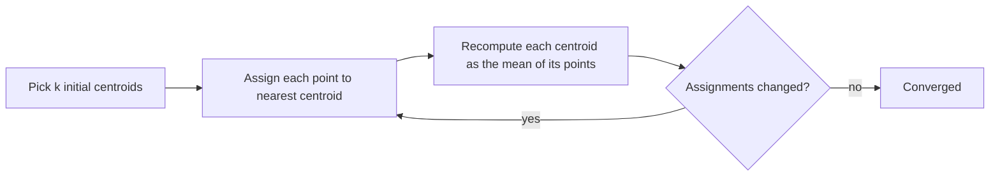

| Type                      |
| ------------------------- |
| Clustering (unsupervised) |

k-Means partitions $n$ unlabeled points into $k$ clusters, each represented by its **centroid** (the mean of its members). Every point belongs to the cluster whose centroid is nearest, so the result is a set of convex, roughly spherical groups. It is a *non-hierarchical* method, in contrast to [[Hierarchical Clustering]].

## Objective
k-Means minimizes the **within-cluster sum of squares** (called *inertia* in scikit-learn):

$$J = \sum_{j=1}^{k} \sum_{x_i \in C_j} \lVert x_i - \mu_j \rVert^2$$

where $\mu_j$ is the centroid of cluster $C_j$. Finding the global minimum is NP-hard, so Lloyd's algorithm is used instead and only guarantees a local minimum.

## Lloyd's Algorithm



1. **Initialize** $k$ centroids (random points, or the smarter *k-means++* seeding that spreads them apart).
2. **Assign** every point to its nearest centroid (Euclidean distance).
3. **Update** each centroid to the mean of the points assigned to it.
4. Repeat 2-3 until assignments stop changing.

Each step can only decrease $J$, so the algorithm always converges, but the answer depends on the starting centroids. Run it several times (`n_init=10` in scikit-learn) and keep the run with the lowest inertia.

## Practical Notes
- **Choosing $k$:** the elbow method (plot inertia vs. $k$ and look for the bend) or the silhouette score (see [[Clustering Evaluation Metrics]]). Inertia always falls as $k$ grows, so it cannot be used alone.
- **Scale your features:** distances dominate the result, so features with large ranges overwhelm the others. See [[Scaling Techniques]].
- **Cluster labels are arbitrary:** "cluster 0" in one run may be "cluster 2" in the next. Any evaluation against ground truth must be label-permutation invariant (purity, Rand index, and so on).
- **Weaknesses:** assumes similar-sized, spherical clusters; sensitive to outliers (means get pulled); needs $k$ upfront. [[Mixtures of Gaussians]] relaxes the shape assumption with soft assignments, and [[Locally Adaptive Clustering (LAC)]] handles clusters that live in different feature subspaces.

## Example: Iris Dataset
The Iris dataset has 150 flowers (50 each of *Iris-setosa*, *Iris-versicolor*, *Iris-virginica*) described by four measurements: sepal length, sepal width, petal length, petal width. Running k-Means with $k=3$ on the four features, **without** using the species labels, and then comparing clusters to the true species:

| Cluster | setosa | versicolor | virginica |
| ------- | -----: | ---------: | --------: |
| 0       | 0      | 48         | 14        |
| 1       | 50     | 0          | 0         |
| 2       | 0      | 2          | 36        |

- Cluster 1 is exactly *setosa*: that species is linearly separable from the others.
- Clusters 0 and 2 split *versicolor* and *virginica* with 16 flowers on the wrong side, because those two species overlap.
- **Purity = (50 + 48 + 36) / 150 = 0.89** and **Adjusted Rand Index = 0.73**. Both are computed in [[Clustering Evaluation Metrics]].

Fitted centroids (cm):

| Cluster | sepal length | sepal width | petal length | petal width |
| ------- | -----------: | ----------: | -----------: | ----------: |
| 0 (mostly versicolor) | 5.90 | 2.75 | 4.39 | 1.43 |
| 1 (mostly setosa)     | 5.01 | 3.43 | 1.46 | 0.25 |
| 2 (mostly virginica)  | 6.85 | 3.07 | 5.74 | 2.07 |

**Petal features** separate the groups cleanly. Clusters (left) closely match the true species (right); the black X marks are centroids:

![[iris-kmeans-petal.png]]

**Sepal features** overlap much more, so the two plots look noticeably different where *versicolor* and *virginica* meet. Clustering used all four features, so a 2D slice can only show part of the structure:

![[iris-kmeans-sepal.png]]

In the plots each cluster is paired one-to-one with the species it overlaps most (Hungarian algorithm, `scipy.optimize.linear_sum_assignment`) and given that species' color and marker, which makes the left and right panels directly comparable despite the arbitrary cluster numbers.

### Code
```python
from sklearn.cluster import KMeans
from sklearn.metrics import adjusted_rand_score
import pandas as pd

kmeans = KMeans(n_clusters=3, n_init=10, random_state=0)
cluster_labels = kmeans.fit_predict(X)           # labels are NOT used for fitting

contingency = pd.crosstab(cluster_labels, y)     # clusters vs true species
purity = contingency.max(axis=1).sum() / contingency.values.sum()
ari = adjusted_rand_score(y, cluster_labels)
```

## Related
- Supervised counterpart on the same data: [[Decision Trees]]
- Evaluation: [[Clustering Evaluation Metrics]]
- Source: [scikit-learn clustering guide](https://scikit-learn.org/stable/modules/clustering.html#k-means)
