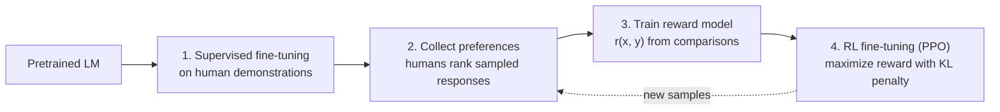

Reinforcement learning from human feedback (RLHF) trains an agent when the reward cannot be written down as a formula but humans can **recognize** good behavior. Instead of a hand-coded reward, a model learns the reward from human judgments, and the agent is then optimized against it. It is best known as the step that turns a pretrained LLM into an instruction-following assistant.

## Why Humans Are in the Loop

- Many goals ("be helpful", "walk gracefully") are easy to judge and hard to specify.
- Hand-written rewards get exploited (reward hacking): the agent maximizes the letter of the reward, not the intent.
- People are better at **comparing** two outputs than at assigning absolute scores, so feedback is collected as preferences.

## The Standard Pipeline (LLMs)

1. **Supervised fine-tuning (SFT).** Fine-tune on labeler-written demonstrations to get a starting policy $\pi_{SFT}$.
2. **Preference collection.** Sample several responses per prompt from the policy; humans rank them or choose the better one.
3. **Reward model.** Fit a scalar scoring model $r_\theta(x, y)$ with a pairwise (Bradley-Terry) loss, where $y_w$ is the preferred and $y_l$ the rejected response:
   $$\mathcal{L}(\theta) = -\mathbb{E}\left[\log \sigma\big(r_\theta(x, y_w) - r_\theta(x, y_l)\big)\right]$$
4. **RL optimization.** Update the policy with PPO (see [[Policy Gradient Methods]]) to maximize the learned reward, with a KL penalty that keeps it close to the reference model:
   $$\max_{\pi}\ \mathbb{E}_{x,\,y\sim\pi}\left[r_\theta(x, y)\right] - \beta\, D_{KL}\big(\pi \,\|\, \pi_{ref}\big)$$
   Without the penalty the policy drifts toward outputs that fool the reward model but read badly.

The reward model stands in for the human, so a limited number of comparisons guides a very large number of RL rollouts.

## A Worked Mini-Example

Prompt: *"Explain gravity to a child."*

| Response | Human judgment |
| -------- | -------------- |
| A: "Gravity is the force by which a planet draws objects toward its center." | Rejected (accurate, but too technical) |
| B: "Gravity is the invisible pull that makes things fall down, like when you drop a ball." | Preferred |

This pair becomes one training example: the reward model is pushed to give B a higher score than A.

## Other Forms of Human-in-the-Loop RL

| Form | What the human provides | Example |
| ---- | ----------------------- | ------- |
| Demonstrations | Expert trajectories to copy (imitation learning) or to infer a reward from (inverse RL, see [[Inverse Reinforcement Learning]]) | Driving from expert logs |
| Preference-based RL | Pairwise comparisons of trajectory segments | Atari and simulated robot locomotion |
| Interactive correction | Corrections or interventions during execution (e.g. DAgger, TAMER) | Operator nudges a robot arm |
| Safe oversight | Approval or veto of risky actions | Human takes over before a dangerous step |

## Variants That Reduce Cost or Complexity

- **DPO (Direct Preference Optimization):** skips the explicit reward model and the RL loop. A closed-form relationship between reward and optimal policy lets the policy be trained on preference pairs with a simple classification loss. The authors report it matches or exceeds PPO-based RLHF on the tasks they tested.
- **RLAIF and Constitutional AI:** replace some human labels with AI judgments guided by written principles.
- **Active querying:** ask humans only about the most informative or uncertain comparisons.

## Limitations

- Human labels are noisy, biased, and expensive.
- The reward model is a **proxy**, so over-optimization gives reward hacking.
- Oversight becomes hard when outputs exceed what a human can evaluate quickly.
- The pipeline is complex and can be unstable (a motivation for DPO).

## Key Results from the Literature

- **Deep RL from human preferences (Christiano et al., 2017):** trained agents on Atari and simulated robot locomotion from pairwise comparisons of trajectory segments, with human feedback on under 1% of agent interactions (about an hour of human time for some novel behaviors).
- **InstructGPT (Ouyang et al., 2022):** SFT followed by RLHF on rankings; outputs from the 1.3B-parameter InstructGPT were preferred over those of the 175B-parameter GPT-3, with improved truthfulness, less toxicity, and little loss on standard NLP benchmarks.

## Sources
- Christiano et al., 2017: [Deep Reinforcement Learning from Human Preferences](https://arxiv.org/abs/1706.03741)
- Ouyang et al., 2022: [Training Language Models to Follow Instructions with Human Feedback](https://arxiv.org/abs/2203.02155)
- Rafailov et al., 2023: [Direct Preference Optimization](https://arxiv.org/abs/2305.18290)

*Verification: results and DPO claims were checked against the paper abstracts. The loss and objective formulas and the mini-example are the standard formulation written from memory, not copied from the papers. Please check the sources.*

## Related Notes
- [[Reinforcement Learning]] - Agent, environment, and reward basics.
- [[Policy Gradient Methods]] - PPO, the optimizer typically used in the RL step.
- [[Large Language Models]] - The models RLHF is most often applied to.
- [[Loss Functions]] - Background on pairwise and classification losses.
