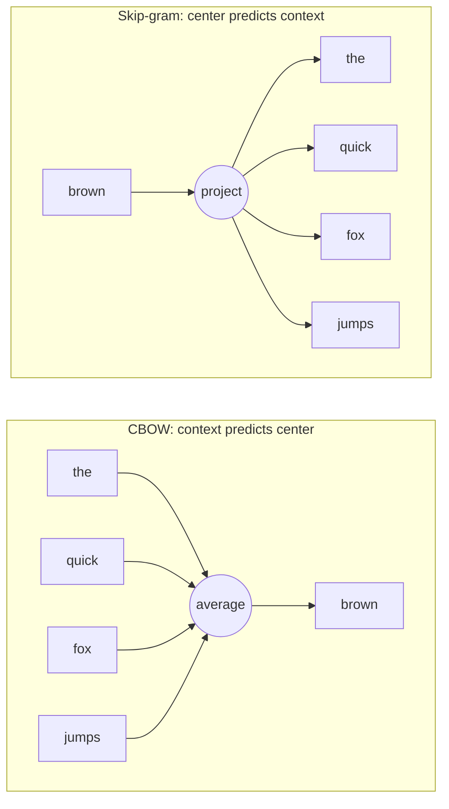

Word2Vec (Mikolov et al., 2013) learns **dense word vectors** from raw text with a very shallow neural network. It rests on the distributional hypothesis: *a word is characterized by the company it keeps*. Words that appear in similar contexts end up with nearby vectors, so "king" and "queen" land close together without anyone labeling them as related.

It replaced sparse count-based representations (one-hot, co-occurrence matrices, see [[3. Word Vectors]]) with vectors of typically 100-300 dimensions that are cheap to train on billions of words.

## Core Idea

Slide a window over a corpus. Each position gives a **center word** and its **context words**. Train a model so that center and context vectors agree. The vectors are not the goal of the task; they are the by-product (the learned weights) of a fake prediction problem.

Example, window size 2 on *"the quick brown fox jumps over"* with center word **brown**:

| Center | Context (outside) words |
| ------ | ----------------------- |
| brown  | the, quick, fox, jumps  |

## Two Architectures



| Variant | Predicts | Strengths |
| ------- | -------- | --------- |
| **CBOW** (Continuous Bag of Words) | center word from the averaged context vectors | Faster to train; smooths over context order; good for frequent words |
| **Skip-gram (SG)** | each context word from the center word | Better for rare words and small corpora; more training pairs per window |

## Network Structure

Both variants are a **one hidden layer network with no nonlinearity**:

1. Input: one-hot vector of size $V$ (vocabulary size).
2. Hidden (projection) layer: $d$ units. Multiplying by the input matrix $W \in \mathbb{R}^{V \times d}$ is just a **row lookup**, which is why this is called an embedding table.
3. Output: a softmax over the vocabulary using a second matrix $W' \in \mathbb{R}^{d \times V}$.

Every word therefore has **two vectors**: a center vector $v_w$ (row of $W$) and a context vector $v'_w$ (column of $W'$). After training, the center vectors (or their average with the context vectors) are used as the embeddings.

The skip-gram objective maximizes the average log probability of context words:

$$J = \frac{1}{T}\sum_{t=1}^{T}\sum_{\substack{-m \le j \le m \\ j \neq 0}} \log P(w_{t+j} \mid w_t), \qquad P(o \mid c) = \frac{\exp(v'^{\top}_o v_c)}{\sum_{w=1}^{V}\exp(v'^{\top}_w v_c)}$$

The denominator sums over the whole vocabulary, which is the expensive part (hundreds of thousands of terms per training step).

## Making It Efficient

### Negative Sampling

Replace the full softmax with a handful of binary decisions: *is this (center, context) pair real, or did I make it up?* For each real pair, draw $k$ random "noise" words and push their dot product with the center word down.

$$\log \sigma(v'^{\top}_{o} v_c) + \sum_{i=1}^{k} \mathbb{E}_{w_i \sim P_n(w)}\!\left[\log \sigma(-v'^{\top}_{w_i} v_c)\right]$$

- Noise words are sampled from the unigram distribution raised to the $3/4$ power, $P_n(w) \propto U(w)^{3/4}$, which boosts rare words relative to frequent ones.
- Typical $k$: 5-20 for small datasets, 2-5 for large ones.
- Cost per pair drops from $O(V)$ to $O(k)$.

### Hierarchical Softmax

Arrange the vocabulary as a Huffman tree and predict the path to a word, so the cost is $O(\log V)$. Frequent words get short paths. Negative sampling is the more commonly used option in practice.

### Subsampling Frequent Words

Words like "the" and "a" carry little information about their neighbors. Each occurrence of word $w_i$ is discarded with probability

$$P(\text{discard}\ w_i) = 1 - \sqrt{\frac{t}{f(w_i)}}$$

where $f(w_i)$ is its corpus frequency and $t \approx 10^{-5}$. This speeds up training and improves vectors for rarer words.

## What the Vectors Capture

Relationships show up as **consistent vector offsets**, so analogies become arithmetic:

$$\vec{\text{king}} - \vec{\text{man}} + \vec{\text{woman}} \approx \vec{\text{queen}}$$

$$\vec{\text{Paris}} - \vec{\text{France}} + \vec{\text{Italy}} \approx \vec{\text{Rome}}$$

Similarity is measured with cosine similarity (see [[3. Word Vectors]]). Nearest neighbors of "Python" will include other programming languages; neighbors of "bank" mix its financial and river senses into one vector.

## Limitations

- **One vector per word**: no polysemy. "Bank" has a single embedding regardless of context. Contextual models such as BERT (see [[Attention & Transformers]]) fix this by producing a different vector for each occurrence.
- **Out-of-vocabulary words** have no vector. FastText addresses this with character n-grams; subword tokenization ([[5. Tokenization]]) is the modern answer.
- **Local windows only**: global co-occurrence statistics are ignored. GloVe combines both views.
- **Static**: vectors are fixed after training and inherit biases in the corpus.

## Minimal Example (gensim)

```python
from gensim.models import Word2Vec

sentences = [["the", "quick", "brown", "fox"], ["the", "lazy", "dog"]]  # tokenized corpus

model = Word2Vec(
    sentences,
    vector_size=100,   # embedding dimension d
    window=5,          # context window m
    min_count=1,       # ignore words rarer than this
    sg=1,              # 1 = skip-gram, 0 = CBOW
    negative=5,        # negative samples k
    sample=1e-3,       # subsampling threshold
)

model.wv.most_similar("fox")
model.wv.most_similar(positive=["king", "woman"], negative=["man"])
```

For a from-scratch PyTorch implementation, see [[Building Embedding Models From Scratch]].

## Sources
- Mikolov et al., 2013: [Efficient Estimation of Word Representations in Vector Space](https://arxiv.org/abs/1301.3781) (introduces CBOW and Skip-gram).
- Mikolov et al., 2013: [Distributed Representations of Words and Phrases and their Compositionality](https://arxiv.org/abs/1310.4546) (negative sampling, subsampling, phrase vectors).
- Stanford CS224n lecture: [Word Vectors](https://www.youtube.com/watch?v=viZrOnJclY0).

## Related Notes
- [[3. Word Vectors]] - Count-based vs. predictive representations and similarity metrics.
- [[Building Embedding Models From Scratch]] - Skip-gram in PyTorch, autoencoder and Siamese embeddings.
- [[Attention & Transformers]] - Contextual embeddings that supersede static word vectors.
- [[Neural Networks]] - The shallow network machinery behind the model.
