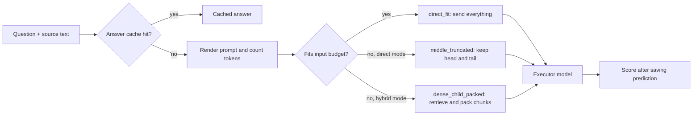

> An execution layer that sends a long document to an LLM whole when it fits, retrieves and packs the most relevant parts when it does not, and optionally reuses verified answers from a semantic cache.

## Quick Facts
- **Context:** CS 800 Special Problems in CS (Spring 2026, In Progress). Formerly "LLM Caching & Recursive Language Models (RLMs)"; renamed in October 2026 because the work is no longer about RLMs and the focus moved from the cache to retrieval under a context budget.
- **Tech Stack:** Python, vLLM, Qwen3.6-35B-A3B (executor), Qwen3-Embedding-0.6B, FAISS, Slurm
- **Links:** [Semantic Cache for Autonomous Agents](https://semantic-cache-agents.vlab-stevens.chatgpt.site/) | [LongBench v2 Full-Run Validation](https://longbench-v2-full-run-20260716.vlab-stevens.chatgpt.site/)

## Overview and Problem
Long-context questions often come with more source text than a model can take in. The research question: compared with sending the full context to the same model, does retrieval under a token budget keep or improve accuracy while using fewer tokens and less time? The project began in March 2026 as a Two-Stage Semantic Cache prototype on Claude models and now runs every experiment on a locally served open-weight model across three long-context benchmarks.

## What I Built
- **Engineered** a benchmark-agnostic `Pipeline` that renders each prompt, counts tokens exactly as vLLM does, and picks one of four routes: `direct_fit`, `middle_truncated`, `unsupported_context` or `dense_child_packed`.
- **Implemented** hybrid retrieval that embeds chunks with Qwen3-Embedding-0.6B, ranks them with FAISS, packs them up to the input budget and restores source order.
- **Designed** small task adapters (documents, question, `render` function) so AA-LCR, MRCR v2 and LongBench-v2 share one pipeline with no benchmark-specific branching.
- **Built** an optional exact and semantic answer cache with a verifier model, kept off by default so gold answers never reach the cache or the verifier.
- **Automated** runs on two GPU servers: a single 96 GB RTX PRO 6000 (AA-LCR, MRCR v2) and a Slurm cluster of 4x L40S nodes (LongBench-v2), with preflight routing reports and dry-run launchers.
- **Validated** the plumbing with 215 unit tests (mocked clients, synthetic fixtures) that run in about 3 seconds.

**Architecture overview**

## Key Results and Impact
All runs use Qwen3.6-35B-A3B, temperature 0, thinking disabled, as a single run per setting.

**AA-LCR** (100 questions, 88K-122K token prompts, 30 September):

| Run | Window / input budget | Accuracy |
|---|---|---:|
| Full context | 262,144 / 258,048 | 61% |
| Hybrid | 65,536 / 61,440 | 54% |
| Middle truncation | 65,536 / 61,440 | 37% |

- Achieved **+17 points** for retrieval over truncation at the same 64K window (95% interval +8.4 to +25.9, clustered by document set); hybrid trails full context by 7 points, which is not significant.
- Caveat: the executor grades its own answers, so absolute scores need an independent grader before reporting.

**MRCR v2** (4-needle release, 30 questions per conversation, deterministic scoring, 29-30 September):

| Conversation | Direct (middle truncation) | Hybrid |
|---:|---:|---:|
| 133K | 63% | 63% |
| 267K | 53% | 50% |
| 533K | 27% | **60%** |
| 1.06M | 10% | **30%** |
| All 120 | 38% | **51%** |

- Reached **51% vs 38%** overall (20 gained, 5 lost, p = 0.004); hybrid gains only once the conversation exceeds the window, because retrieval finds the needles about twice as often as truncation keeps them.
- Found that most remaining errors copy the wrong occurrence of a real needle, so the model's counting is the limit.

**LongBench-v2** (503 questions, August, older runner): on the 107 questions that did not fit, hybrid scored **56.1% vs 41.1%** for truncation (p = 0.0025), and the semantic cache answered 493 of 503 paraphrased questions while roughly halving total tokens. A rerun on the shared pipeline is next.

## Core Learnings
- Retrieval pays off only when the input exceeds the window; on prompts that fit, direct and hybrid send identical requests.
- Budget flags do not change the server: vLLM fixes the served window at launch, so the runner's budget must stay within it.
- A run in which every request fails can still finish with a score of 0 unless it fails fast, and a self-grading executor inflates confidence in absolute scores.
- Open work: LongBench-v2 on the shared pipeline, independent AA-LCR grading, separating the MRCR chunk-size effect (3,500 vs 7,500 tokens), and testing the answer cache beyond mocks.

---
*Related:* [[Projects MOC]], [[LM Benchmarks]], [[KV Cache]], [[Agentic Information Traversal]]
