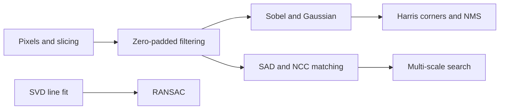

> A growing portfolio of CS558 Computer Vision work, from from-scratch Harris corner detection and RANSAC line fitting to template matching under heavy noise and across three scales.

## Quick Facts
- **Context:** CS558 Computer Vision Coursework, Stevens Institute of Technology (Fall 2026): Homework 1 and 2 plus in-class exercises
- **Tech Stack:** Python, NumPy, OpenCV (file I/O and display only), Matplotlib, mediapy, Jupyter
- **Links:** None available

## Overview and Problem
The assignments share one rule: no library function may operate on the images, so padding, filtering, convolution and resizing are all hand-written. Homework 1 builds a corner detector (Sobel, Gaussian smoothing, Harris response, non-maximum suppression) on 800 x 531 photographs. Homework 2 detects a 38 x 32 logo in a noisy 150 x 300 image with SAD and NCC, then finds four logo instances at three scales in a 486 x 612 map where each instance has its own unknown brightness and contrast change. Exercises cover NumPy image basics and robust line fitting.

## What I Built
- **Implemented** a complete Harris corner detector from scratch: zero-padded convolution, Sobel gradients, a Gaussian kernel generator, the structure-tensor response, and 3 x 3 non-maximum suppression with a relative threshold.
- **Implemented** sliding-window SAD and zero-mean NCC matchers in NumPy, with the template statistics hoisted out of the loop and an epsilon guard for flat windows.
- **Evaluated** both matchers on 8 noise levels (10% to 80%) with an exact-location detection check and a results table.
- **Designed** a multi-scale search that blurs and shrinks the image by **2x and 4x** instead of resizing the template, zeroes out found instances, and maps coordinates back to the original.
- **Built** a RANSAC line fitter on synthetic data with SVD-based total least squares, and explored the effect of noise level and threshold.
- **Practised** NumPy image manipulation: slicing, masking, thresholding, colour masks, blending, and box filtering.

![[multiscale-matching-pipeline.png]]

## Key Results and Impact
- Produced **241 corners** on a test photograph with Harris at a threshold of 10% of the peak response, inside the 100 to 300 target (a 1% threshold gave about 2000).
- Located the logo at exact coordinates up to a **30% noise label with SAD** and **50% with NCC**, with SAD failing at 40% and NCC at 60% (about 64% and 84% of pixels actually corrupted, since salt and pepper are separate masks).
- Found all **4 of 4** instances with NCC at (100, 320), (430, 250), (200, 250) and (300, 60), while SAD found only the first.
- Recovered a noise-free line exactly with the SVD fit, and showed RANSAC with a 100-point sample at threshold 0.5 counting 25 inliers, matching the roughly **26%** expected when the threshold is a third of the noise standard deviation.

## Core Learnings
- Corners need gradients in both directions, and a relative threshold on the response controls how many survive: see [[Harris Corner Detector]].
- Zero padding invents edges and corners at the image border: see [[Image Borders and Padding]].
- Trade-offs between SAD (cheap, exact copies) and NCC (affine-invariant, more expensive): see [[Template Matching]].
- NCC's noise robustness comes from comparing patterns, not from its brightness and contrast invariance, because salt-and-pepper noise is neither.
- Low-pass filtering before subsampling prevents aliasing, and sigma should scale with the downsampling factor: see [[Aliasing and Downsampling]].
- Least squares is dragged by outliers, while RANSAC's consensus voting ignores them: see [[RANSAC]].

---
*Related:* [[Projects MOC]], [[Computer Vision MOC]], [[Harris Corner Detector]], [[Multi-Scale Template Matching]], [[RANSAC]], [[Template Matching Snippets]]
