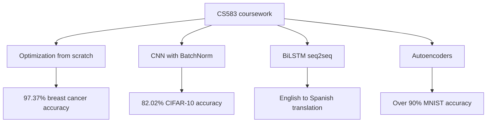

> A series of core deep learning projects covering mathematical optimization, computer vision, sequence modeling, and representation learning.

## Quick Facts
- **Context:** CS583 Deep Learning Coursework (Spring 2026)
- **Tech Stack:** Python, TensorFlow/Keras, Keras Tuner, NumPy, scikit-learn, Matplotlib
- **Links:** None available

## Overview and Problem
This portfolio encompasses four major assignments designed to build intuition and practical skills in deep learning. The projects span from from-scratch optimization algorithms to complex sequence models and autoencoders.

## What I Built
- **Implemented** Logistic Regression and multiple optimizers (Batch GD, SGD, Mini-Batch GD) from scratch using NumPy.
- **Designed** and trained a custom Convolutional Neural Network (CNN) architecture with Batch Normalization for CIFAR-10 image classification.
- **Built** a character-level Encoder-Decoder seq2seq model using Bidirectional LSTMs for English-to-Spanish translation.
- **Engineered** a dense autoencoder with a 2D bottleneck layer, eventually extending it to a supervised autoencoder with a joint reconstruction and classification objective.

**Architecture overview**

## Key Results and Impact
- Achieved 97.37% test accuracy on Breast Cancer classification using SGD, and demonstrated the generalization effect of L2 regularization.
- Attained 82.02% test accuracy on CIFAR-10 after addressing overfitting and conducting systematic hyperparameter tuning.
- Yielded >90% classification accuracy on MNIST using supervised 2D latent features, confirming the value of label supervision for discriminative representations.

---
*Related:* [[Projects MOC]]
