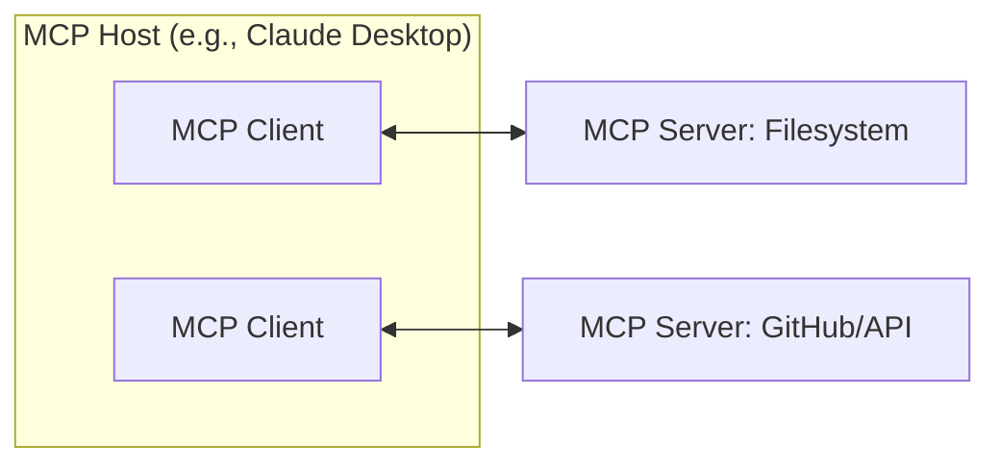

The **Model Context Protocol (MCP)** is an open standard that enables AI applications (hosts) to seamlessly integrate with external data sources and tools. It provides a standardized way for AI models to access the "context" they need to perform tasks effectively.

## Core Participants

The MCP ecosystem consists of three primary roles:

1. **MCP Host**: The main AI application (e.g., Claude Desktop, IDEs) that orchestrates the interaction. It manages one or multiple MCP clients.
2. **MCP Client**: A component within the host that maintains a connection to a specific MCP server.
3. **MCP Server**: A standalone program that exposes specific capabilities (tools, resources, prompts) to clients.

## Architectural Layers

MCP is divided into two distinct layers to separate the "what" (data) from the "how" (transport).

### 1. Data Layer
The data layer defines the protocol for communication, based on **JSON-RPC 2.0**.
- **Lifecycle Management**: Handles connection initialization, capability negotiation, and termination.
- **Primitives**: The core building blocks of context:
    - **Tools**: Executable functions (e.g., `calculate`, `search_files`).
    - **Resources**: Static or dynamic data sources (e.g., file contents, DB records).
    - **Prompts**: Reusable interaction templates.
- **Server Features**: 
    - **Sampling**: Servers can request the host LLM to generate completions (model-independent).
    - **Elicitation**: Servers can ask the user for additional information or confirmation.
    - **Logging**: Servers can send debug info to the client.

### 2. Transport Layer
The transport layer defines how messages are physically moved between participants.
- **Stdio Transport**: Uses standard input/output for local processes. High performance, zero network overhead.
- **Streamable HTTP Transport**: Uses HTTP POST and Server-Sent Events (SSE) for remote communication. Supports authentication (OAuth, API keys).

---

## Connection Lifecycle

The connection follows a strict initialization sequence to ensure compatibility.

1. **Initialization Request**: Client sends `initialize` with its `protocolVersion` and `capabilities`.
2. **Initialization Response**: Server responds with its own version, `capabilities`, and `serverInfo`.
3. **Protocol Negotiation**: If versions match, they proceed; otherwise, the connection is terminated.
4. **Initialized Notification**: Client sends a `notifications/initialized` message to signal the connection is ready for traffic.

---

## Key Primitives

### Tools
Tools are the "hands" of the AI. They allow the model to perform actions.
- **Discovery**: Clients list tools via `tools/list`.
- **Execution**: Clients call tools via `tools/call` with specific arguments validated against a JSON Schema.

### Resources
Resources are the "knowledge" provided to the AI.
- **Discovery**: Clients list resources via `resources/list`.
- **Access**: Clients read resource content via `resources/read`.

### Notifications
MCP is dynamic. Servers can notify clients of changes without being polled.
- **Example**: `notifications/tools/list_changed` tells the client to refresh its tool list because a new tool became available or one was removed.

---

## Why MCP Matters

- **Decoupling**: Separates the AI application logic from the specific tool/data implementations.
- **Security**: Hosts can implement fine-grained permissions for each server.
- **Extensibility**: Anyone can build a server to expose their API or local data to any MCP-compatible AI.

---
*Source: [Model Context Protocol Architecture](https://modelcontextprotocol.io/docs/learn/architecture)*

## Related Notes
- [[Software Engineering MOC]]
- [[AI App Generation and Discovery]]
- [[JSON-RPC Protocol]]
